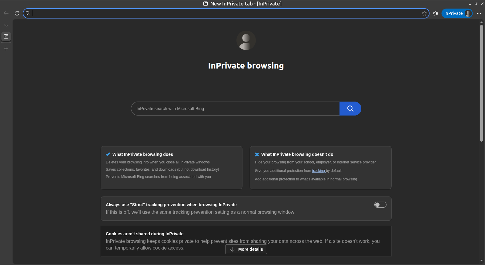

# Gestión de la privacidad

## Gestionar la privacidad

La privacidad en Internet se refiere a tu capacidad para controlar la información personal que compartes y la forma en que esta es recopilada, utilizada, almacenada y difundida por servicios digitales, empresas, organizaciones y otras personas. Cada vez que navegas por Internet, utilizas una aplicación, participas en una red social o interactúas con un servicio en línea, generas información que puede revelar aspectos de tu identidad, hábitos, intereses o comportamiento [@WIKI-privacidad].

En la actualidad, gestionar la privacidad no consiste únicamente en decidir qué datos publicas de forma consciente. También implica comprender qué información recopilan los servicios que utilizas, qué permisos les concedes, cómo se utilizan tus datos y quién puede acceder a ellos.

La expansión de la inteligencia artificial ha incrementado la importancia de una gestión responsable de la privacidad. Los sistemas de IA pueden analizar grandes cantidades de información, relacionar datos procedentes de diferentes fuentes e incluso inferir características personales a partir de información aparentemente inocua. Por ello, es importante reflexionar antes de compartir datos personales, fotografías, documentos, grabaciones de voz u otros contenidos en plataformas digitales.

En esta unidad aprenderás a gestionar tu privacidad de forma más consciente y segura, reduciendo la exposición innecesaria de información personal y fortaleciendo tu capacidad para tomar decisiones informadas sobre tu presencia digital.

## Datos personales sensibles

Cuando se habla de datos personales sensibles en la red, se refiere a aquellos datos que están revelando información privada, como por ejemplo, el domicilio o cualquier otra información de carácter privado, costumbres o hábitos. Así como acciones que ubican o determinan a una persona en posibles situaciones futuras que pudiesen abrir una brecha de vulnerabilidad en la vida privada de ésta. Un ejemplo sería subir a la red que te vas de vacaciones, de manera que estás diciendo a los ciberdelincuentes que tu casa estará vacía.

Estos datos personales reciben una protección especial por parte de la normativa europea de protección de datos y que estan recogidos en el  Reglamento General de Protección de Datos (RGPD) [@RGPD] y denominados como categorías especiales de datos personales, siendo más comúnmente conocidos como datos sensibles.

Entrando en un terreno más específico. los datos sensibles son aquellos que, de difundirse indebidamente podrían afectar la esfera más íntima del ser humano. Entre ellos se encuentran:

- El origen racial o étnico.

- Los datos relativos a la salud.

- Los datos genéticos y biométricos utilizados para identificar a una persona.

- Las creencias religiosas o filosóficas.

- Las opiniones políticas.

- La afiliación sindical.

- Los datos relativos a la vida sexual o la orientación sexual.

La protección de estos datos es especialmente importante porque una divulgación indebida puede afectar a la intimidad, la dignidad, la seguridad o los derechos fundamentales de las personas.

La expansión de la inteligencia artificial añade nuevos desafíos a la privacidad. Actualmente, algunos sistemas pueden analizar grandes cantidades de información y deducir características personales sensibles a partir de datos que, por sí solos, parecen inofensivos. Fotografías, patrones de comportamiento, historiales de navegación o publicaciones en redes sociales pueden utilizarse para elaborar perfiles detallados sobre una persona.

Por ello, comparte únicamente la información necesaria, revisa cuidadosamente la configuración de privacidad de los servicios que utilizas y reflexiona antes de publicar información personal que pueda ser utilizada para identificarte, localizarte o elaborar perfiles sobre ti.

## Oversharing o sobreexposición

El Oversharing es la sobreexposición de información personal en Internet y, en su mayoría, en los medios sociales a través de tus perfiles sociales. Actualmente también puede producirse al compartir de forma excesiva información personal con aplicaciones, asistentes virtuales o herramientas basadas en inteligencia artificial, especialmente cuando se introducen datos privados, documentos, fotografías o conversaciones que no son necesarios para obtener el servicio solicitado.

De esta manera, tu vida queda totalmente expuesta y aunque el propósito de ello sea totalmente lícito e incluso plausible, estos datos, imágenes o información pueden volverse en tu contra por un uso indebido o ilícito por parte de terceros.

La acumulación o exceso de información personal disponible públicamente puede facilitar que terceros elaboren perfiles detallados sobre ti, conozcan tus rutinas, identifiquen tus intereses o deduzcan información privada que nunca has compartido de forma explícita. Por ejemplo, fotografías, comentarios, ubicaciones, horarios habituales o publicaciones aparentemente inocuas pueden revelar mucho más de lo que imaginas cuando se analizan conjuntamente.

La expansión de la inteligencia artificial ha incrementado algunos de estos riesgos. Actualmente existen sistemas capaces de analizar grandes cantidades de información pública, reconocer patrones, relacionar datos procedentes de distintas fuentes e incluso generar perfiles automatizados. Además, imágenes, vídeos o grabaciones de voz compartidas en Internet pueden ser reutilizadas para crear contenidos sintéticos o intentar suplantar la identidad de una persona.

Una sobre exposición excesiva, puede dar lugar al ciberchantaje, ciberextorsión, ciberacoso o robo de información personal a través de algún tipo de técnica. Además, de exponerte al riesgo de un posible robo y/o suplantación de identidad [@AEPD-oversharing].

## Privacidad en tus cuentas

La mayoría de las personas dispone de cuentas de usuario en numerosos servicios digitales, como correo electrónico, redes sociales, plataformas de vídeo, aplicaciones de mensajería, servicios de almacenamiento en la nube o tiendas en línea. Cada una de estas cuentas recopila y gestiona información personal que conviene proteger adecuadamente.

Servicios como [Google](https://myaccount.google.com/data-and-personalization), [Microsoft](https://account.microsoft.com/account/privacy) y muchas otras plataformas ofrecen herramientas para configurar la privacidad y controlar cómo se utilizan tus datos. Es recomendable revisar estos ajustes periódicamente, ya que las opciones disponibles y las políticas de privacidad pueden cambiar con el tiempo.

Actualmente, muchas plataformas utilizan sistemas de inteligencia artificial para personalizar contenidos, mostrar publicidad, realizar recomendaciones o mejorar sus servicios. En algunos casos, la información que compartes puede utilizarse para entrenar o perfeccionar estos sistemas. Por ello, es aconsejable consultar las opciones relacionadas con el uso de tus datos y seleccionar aquellas que mejor se adapten a tus preferencias.

En las redes sociales, como  [Facebook](https://es-la.facebook.com/help/325807937506242), [X](https://help.x.com/es/safety-and-security#ads-and-data-privacy), [Instagram](https://es-es.facebook.com/help/instagram/196883487377501/?helpref=hc_fnav&bc[0]=Ayuda%20de%20Instagram&bc[1]=Administrar%20tu%20cuenta), [TikTok](https://support.tiktok.com/es/account-and-privacy) o similares, se comparte una gran cantidad de información personal. Siempre que sea posible, es recomendable configurar la cuenta con un nivel de privacidad elevado y limitar la visibilidad de tus publicaciones únicamente a las personas que tú decidas.

Entre los principales ajustes que conviene revisar se encuentran:

- Privacidad de las publicaciones: decide quién puede ver el contenido que compartes (público, contactos, amigos o solo tú).

- Etiquetas y menciones: controla quién puede etiquetarte y quién puede visualizar las publicaciones en las que apareces.

- Comentarios y mensajes: limita quién puede interactuar contigo mediante comentarios, mensajes directos o solicitudes de contacto.

- Bloqueo y restricción de usuarios: impide que personas no deseadas puedan contactar contigo o acceder a tu perfil.

- Ubicación y actividad: revisa si la plataforma almacena información sobre tus desplazamientos, búsquedas o actividad y ajusta estas opciones según tus necesidades.

- Aplicaciones conectadas: comprueba qué aplicaciones o servicios externos tienen acceso a tu cuenta y elimina aquellos que ya no utilices.

- Permisos del dispositivo: revisa periódicamente los permisos concedidos a la aplicación, especialmente el acceso a la ubicación, cámara, micrófono, contactos y fotografías.

Recuerda que la configuración predeterminada de una plataforma no siempre es la más favorable para tu privacidad. Dedicar unos minutos a revisar estos ajustes puede ayudarte a reducir la exposición de tus datos personales y a mantener un mayor control sobre tu información en Internet.

Tienes más información en el siguiente enlace: [Configuración de privacidad en redes sociales](https://www.incibe.es/ciudadania/tematicas/privacidad/configuraciones-redes-sociales)

## Navegación privada

La navegación privada, también conocida como modo incógnito o modo privado, es una función disponible en la mayoría de los navegadores web que evita que determinada información de tu sesión se almacene en el dispositivo una vez que cierras las ventanas de navegación privada [@navegacion-privada].

Cuando utilizas este modo, el navegador normalmente no conserva el historial de navegación, las búsquedas realizadas, las cookies de la sesión, la información introducida en formularios ni otros archivos temporales una vez finalizada la sesión.

```{r, echo=FALSE, out.width='75%', fig.align='center', fig.cap='Navegación privada navegador Microsoft-edge.'}

```

Sin embargo, es importante comprender sus limitaciones. La navegación privada mejora la privacidad en el dispositivo que estás utilizando, pero no te convierte en una persona anónima en Internet. Tu actividad puede seguir siendo visible para los sitios web que visitas, los servicios en los que inicias sesión, tu proveedor de Internet, tu empresa, tu centro educativo o el administrador de la red desde la que te conectas.

Además, si accedes a servicios como Google, Microsoft, Facebook, Instagram, X o cualquier otra plataforma mediante tu cuenta personal, la actividad realizada podrá seguir asociándose a tu perfil aunque estés utilizando una ventana de navegación privada.

También debes tener en cuenta que este modo no protege frente a programas maliciosos, ataques de phishing ni técnicas avanzadas de seguimiento utilizadas por algunos sitios web, como la huella digital del navegador (browser fingerprinting), que intenta identificar tu dispositivo mediante sus características técnicas.

No es lo mismo navegar de forma privada que navegar de forma anónima. Para aumentar el anonimato en Internet se requieren herramientas y medidas adicionales, como la red [TOR](https://www.torproject.org/) y otras soluciones específicas orientadas a proteger la identidad y dificultar el rastreo de la actividad en línea.

El uso de la navegación privada puede resultar especialmente útil en situaciones como las siguientes:

- Utilizar un ordenador compartido o de terceros.

- Acceder temporalmente a una cuenta sin que la sesión quede almacenada en el navegador.

- Realizar búsquedas o consultas que no deseas que aparezcan posteriormente en el historial local del dispositivo.

- Comparar resultados o contenidos web reduciendo la influencia de las cookies almacenadas previamente.

Por otra parte, algunos navegadores y buscadores incorporan funciones de protección de la privacidad de forma predeterminada, incluyendo el bloqueo de rastreadores y técnicas de seguimiento. Entre ellos se encuentran [Epic](https://www.epicbrowser.com/), [Brave](https://brave.com/es/) o buscadores como [DuckDuckGo](https://duckduckgo.com/)

Recuerda que la navegación privada es una herramienta útil para proteger tu privacidad local, pero no debe considerarse una solución completa para preservar tu anonimato o impedir toda recopilación de datos en Internet.

## VPN (Red privada virtual)

Otra manera más de proteger tu privacidad, es hacer uso de una VPN (son las siglas de Virtual Private Network) [@AVAST-vpn].
  
Las VPN son una tecnología de red que permiten una extensión de tu conexión local o LAN, permitiendo conectar varios dispositivos como si se encontrasen físicamente en el mismo lugar. Entre sus ventajas está la de ofrecer una mayor privacidad al ocultar tu localización, pero también, y este el caso que nos compete, el que parezca que tu conexión esté realizándose en otro país concreto, con lo que uno se puede saltar censuras o acceder a contenidos de servicios locales. 

Su principal particularidad es que se trata de una conexión segura y cifrada. Esto hace que no sea posible conocer la información que viaja en la petición que se realiza, así como tampoco la IP pública que identifica tu dispositivo, ya que la conexión se realiza a través de los muchos router VPN en diferentes ubicaciones.

Las VPN suelen ser aplicaciones o extensiones de terceros, aunque el navegador [OPERA](https://www.opera.com/es) lo trae por defecto. Lo único que tendrás que hacer es activarla desde sus opciones, y se creará una conexión cifrada entre tu dispositivo y un servidor VPN para esconder tu ubicación real.

## Cookies

Una cookie es un fichero que guarda nuestro navegador, donde se almacenan pequeñas cantidades de datos, de manera que el sitio web puede consultar la actividad previa del navegador.

Su propósito principal es identificar al usuario almacenando su historial de actividad de un sitio web específico, de manera que se le pueda ofrecer el contenido más apropiado según sus hábitos. Esto quiere decir que cada vez que visitas una página web por primera vez, se guarda una cookie en el navegador con un poco de información. Luego, cuando visitas nuevamente la misma página, el servidor pide la misma cookie para arreglar la configuración del sitio y hacer la visita del usuario tan personalizada como sea posible [@cookies-navegador].

Existe la opción de navegar sin cookies gracias a las sesiones privadas que tienen los distintos navegadores, como has podido ver en el apartado anterior. De esta forma no se almacenará ningún tipo de información en tu ordenador cuando navegues en una web y del mismo modo tampoco recordará nada después al volver a navegar de nuevo.

Es importante que con frecuencia elimines las cookies, ahora que sabes que manejan información privada y además ocupan espacio en tu dispositivo. Existen dos formas manuales de hacerlo. La primera de ellas es desde el menú de opciones del propio navegador y la otra es con un software específico para tal cometido, como por ejemplo [Ccleaner](https://www.ccleaner.com/es-es). Pero si quieres automatizar esta tarea, prácticamente todos los navegadores disponen de una configuración para que una vez  cierres el navegador se realice una limpieza de manera automática. La siguiente imagen te muestra la opción que debes buscar en el navegador Google Chrome, para ello ve al Menu del navegador, entra en Configuracíón, luego Privacidad y seguridad, a continuación, Cookies y finalmente Borrar las cookies y los datos de sitios al salir de Chrome, pero debes tener en cuenta que las ubicaciones pueden variar con las actualizaciones. Si usas otro navegador puede ser que varíe la ruta de acceso, pero a grandes rasgos suelen ser muy parecidas y también se acceden a ellas a través del menú de opciones.

```{r, echo=FALSE, out.width='75%', fig.align='center', fig.cap='Eliminar cookies automáticamente al cerrar Google Chrome.'}
knitr::include_graphics('images/borrado-cookies-cierre-navegador.png')
```

Por otro lado si quieres deshacerte de la incómoda notificación de cookies de las web, puedes instalar en el navegador el plugin [I don’t care about cookies](https://www.i-dont-care-about-cookies.eu/).

Si quieres más información detallada sobre las cookies visita este enlace [por qué borrar las cookies](https://www.osi.es/es/actualidad/blog/2019/09/11/por-que-borrar-las-cookies-del-navegador) y este otro [tipos de cookies, configuración y consejos](https://www.osi.es/es/actualidad/blog/2018/07/18/entre-cookies-y-privacidad) de la Oficina de Seguridad del Internauta donde las analizan con más detalle. 

Al hilo de las cookies debes saber que estas no son la única manera que existe de tracear nuestra actividad en internet y que hay técnicas más sofisiticadas. Estas técnicas son conocidas como Fingerprinting y hacen un rastreo de tu huella digital. Por lo tanto, el fingersprinting es una técnica que permite obtener información de una persona o empresa a través de los sistemas informáticos.

Si quieres profundizar más en este tema te recomiendo que visites el siguiente enlace [¿Qué es el fingerprinting?](https://protecciondatos-lopd.com/empresas/fingerprinting-que-es/).

Para que te hagas una idea de lo que implica una política de cookies, a continuación tienes un ejemplo de los tipos de cookies y sus funciones.

Política de Cookies:
El portal web "x" hace uso de cookies. Con su aceptación de la presente política concede su permiso para obtener datos estadísticos de su navegación en esta web, en cumplimiento del Real Decreto-ley 13/2012. Si continúa navegando consideramos que acepta el uso de cookies.

¿Qué son las cookies?
Las cookies son archivos que las páginas web almacenan en el navegador del usuario que las visita, necesarias para aportar a la navegación web ventajas en la prestación de servicios interactivos.

Tipos posibles de cookies:

- Cookies de sesión: Son un tipo de cookies diseñadas para recabar y almacenar datos mientras el usuario accede a una página web, y no queda registrada en el disco del usuario.

- Cookies persistentes: Son un tipo de cookies en el que los datos siguen almacenados en el terminal y pueden ser accedidos y tratados durante un periodo definido por el responsable de la cookie, y que puede ir de unos minutos a varios años.

- Propias: son cookies generadas por la propia página web que se está visitando.

- De terceros: son cookies que se reciben al navegar por esa página web, pero que han sido generadas por un tercer servicio que se encuentra hospedado en ella.

Fines de las cookies:

- Fines técnicos: Son necesarias para el funcionamiento de la página web. Son las denominadas también estrictamente necesarias. Hacen posible el control de tráfico desde el servidor a múltiples usuarios a la vez, la identificación y el acceso como usuario del sistema, etc.

- Personalización: Hacen posible que cada usuario pueda configurar aspectos como el lenguaje en el que desea ver la página web o la configuración regional.

- Análisis o rendimiento: Permiten medir el número de visitas y criterios de navegación de diferentes áreas de la web de forma anónima.

- Publicidad: Permiten implementar parámetros de eficiencia en la publicidad ofrecida en las páginas web.

- Publicidad comportamental: Permiten implementar parámetros de eficiencia en la publicidad ofrecida en las páginas web, basados en información sobre el comportamiento de los usuarios.

Uso de Cookies:

La web "x" SOLO utiliza las siguientes COOKIES: Cookies de tipo comportamental para el almacenamiento de sesión y de caché para mejorar su experiencia.

- Cookies de análisis: Son aquéllas que permiten al responsable de las mismas, el seguimiento y análisis del comportamiento de los usuarios de los sitios web a los que están vinculadas. La información recogida mediante este tipo de cookies se utiliza en la medición de la actividad de los sitios web, aplicación o plataforma y para la elaboración de perfiles de navegación de los usuarios de dichos sitios, aplicaciones y plataformas, con el fin de introducir mejoras en función del análisis de los datos de uso que hacen los usuarios del servicio.

- Cookies publicitarias: Son aquéllas que permiten la gestión, de la forma más eficaz posible, de los espacios publicitarios que, en su caso, el editor haya incluido en una página web, aplicación o plataforma desde la que presta el servicio solicitado en base a criterios como el contenido editado o la frecuencia en la que se muestran los anuncios.

- Cookies de publicidad comportamental: Son aquéllas que permiten la gestión, de la forma más eficaz posible, de los espacios publicitarios que, en su caso, el editor haya incluido en una página web, aplicación o plataforma desde la que presta el servicio solicitado. Estas cookies almacenan información del comportamiento de los usuarios obtenida a través de la observación continuada de sus hábitos de navegación, lo que permite desarrollar un perfil específico para mostrar publicidad en función del mismo.

- Estrictamente necesarias: Las Cookies estrictamente necesarias le permiten navegar por la página web y usar sus funciones esenciales.

Relacionado con las cookies también exite el ciberataque conocido como el secuestro de cookies que puedes leer en este artículo [¿Qué es el secuestro de cookies de sesión y cómo puede afectarte?](https://www.incibe.es/ciudadania/blog/que-es-el-secuestro-de-cookies-de-sesion-y-como-puede-afectarte)

## Permisos cámara, micrófono y localización.

Una práctica muy saludable en el uso de la cámara o webCam e incluso el micrófono, es tenerla tapada cuando no la estés usando y si no fíjate en la foto que se muestra a continuación  que le tomaron a Mark Zuckerberg.

```{r, echo=FALSE, out.width='75%', fig.align='center', fig.cap='WebCam y micrófono del ordenador tapados.'}
knitr::include_graphics('images/webca-mark-zuckerberg.png')
```

Para tener el control total sobre las funcionalidades de cámara, micrófono y ubicación, debes establecer los permisos en la opción de Preguntar, lo verás más claramente en la imagen que se muestra más abajo. Para establecer estos parámetros existen dos maneras de hacerlo, uno de ellas es a través de las opciones que te da el menú de configuración del propio navegador, y para ello debes ir a  Menú navegador, buscar Configuracíón, después Privacidad y seguridad, a continuación Configuración de sitios web y finalmente Permisos. Como ya se indicó en el caso de borrado de cookies automático, debes tener en cuenta que las ubicaciones pueden variar con las actualizaciones que reciba el navegador.

```{r, echo=FALSE, out.width='75%', fig.align='center', fig.cap='Ajustes permisos cámara, micrófono y ubicación desde el menú de opciones del navegador.'}
knitr::include_graphics('images/ajuste-permisos.png')
```

Aunque estos permisos son los más importantes cuando navegas por internet, si te fijas en la  figura 2.4 verás que no son los únicos  y que entre éstos se encuentran los de notificaciones o los de ventanas emergentes entre otros.

La otra forma es más sencilla e incluso te permite cambiar los permisos directamente desde el navegador sin tener que ir al menú de opciones y esto lo tienes haciendo click en el candado de la barra de direcciones. Se trata del mismo candado que nos acredita que estamos ante una web segura. Puedes verlo en la siguiente imagen.

```{r, echo=FALSE, out.width='75%', fig.align='center', fig.cap='Ajustes permisos cámara, micrófono y ubicación desde el candado de la barra de direcciones.'}
knitr::include_graphics('images/ajuste-permisos-desde-navegador.png')
```

Para concluir, no debes olvidar que con las aplicaciones móviles sucede lo mismo, y que puedes gestionarlos de igual manera desde ajustes del dispositivo. Visita los siguientes enlaces dependiendo de tu smartphone, [cambiar los permisos de las aplicaciones en teléfonos Android](https://support.google.com/android/answer/9431959?hl=es) o [controlar el acceso a la información en las apps en el iPhone](https://support.apple.com/es-es/guide/iphone/iph251e92810/ios). En el siguiente enlace, [permisos aplicaciones  móviles](https://www.osi.es/sites/default/files/docs/c5-eg-permisos-apps-riesgos.pdf) encontrarás una tabla con los permisos y los riesgos que entrañan.

## La nube

Como ya sabrás el almacenamiento en la nube, es el almacenamiento de datos en servidores por lo general aportados por terceros y que gracias a esto, puedes disponer de ellos desde cualquier lugar y dispositivo, con solo tener conexión a internet y conectarte al servicio donde están alojados tus datos. De esta manera ya no es necesario llevar contigo el dispositivo físico donde tienes almacenada tu información. Algunos de estos servicios más conocidos son [Google drive](https://www.google.com/intl/en_in/drive/), [One drive](https://www.microsoft.com/en-us/microsoft-365/onedrive/online-cloud-storage) o [Dropbox](https://www.dropbox.com/) entre otros.

Antes de decidirte por cuál de los proveedor de servicio en la nube debes decantarte, ten en cuenta los siguientes:

- Donde va a estar ubicada tu información. Esto te permitirá conocer la legislación y
garantías de protección de tus datos en el país donde se encuentren.

- Saber si la plataforma comparte información con terceros o no.

- Si la web cuenta con certificado digital y es accesible mediante https.

- Mecanismos de cifrado, ya que éstos maximizan la seguridad de los datos.

- Políticas de privacidad.

De otro lado también puedes tomar tus propias medidas de seguridad cifrando tu datos antes de subirlos. Para ello puedes usar esta herramienta llamada  [cryptomator](https://cryptomator.org/).

En este enlace encontrarás un estudio completo de los diferentes [servicios de almacenamiento en la nube](https://www.osi.es/sites/default/files/docs/osi_servicios_nube.pdf) y sus características.

A la hora de compartir tus datos alojados en la nube debes tener en cuenta que solo es recomendable compartirlos con personas de confianza, ya que de lo contrario podrían hacer un mal uso de ello, o simplemente una mala gestión que provoque la pérdida de la información.

## Correo electrónico y apps de mensajería

El correo electrónico es uno de los servicios web que más se suele utilizar. Por ello, debes saber que muchos de los gestores de emails que son utilizados a diario, no aplican estrictas políticas de privacidad, por lo que tus correos podrías ser leídos y rastreados no solo por terceros con intenciones poco saludables sino también por éstos mismos servicios de correo.

Esto no tiene por qué ser un inconveniente si no envías información sensible, pero si no es el caso quizá preferirías usar un gestor de correos que sí te garantice una privacidad completa en tus envíos. De ser este tu caso puedes usar  [Protonmail](https://protonmail.com/), [Tutanota](https://tutanota.com/es/) o [Fastmail](https://www.fastmail.com) que sí tienen en cuenta este aspecto, aunque no son los únicos. En el siguiente enlace tienes una lista de otras [alternativas de emails privadas](https://blogthinkbig.com/alternativas-gratuitas-gmail-outlook-privacidad).

Si por el contrario prefieres ser tu quien gestiones esa capa de privacidad adicional, puedes optar por hacer uso de otras herramientas de encriptado que podrás ver en este artículo de [cómo encriptar y proteger tu correo electrónico](https://www.osi.es/es/actualidad/blog/2019/07/31/como-encriptar-y-proteger-tu-correo-electronico).

Otra alternativa de envío de correos cifrados, es el uso de la opción de correos confidenciales de Gmail. De esta manera el receptor necesitará un código para desbloquear el contenido del email que, recibirá a través de SMS en su smartphone. Más información en el siguiente enlace [Enviar y abrir correos confidenciales](https://support.google.com/mail/answer/7674059?hl=es&co=GENIE.Platform%3DDesktop).

Si además quieres saber si tu cuenta de correo o tu número de teléfono han sido comprometidos, puedes saberlo a través de la siguiente plataforma [haveibeenpwned](https://haveibeenpwned.com/).

Con respecto a las aplicaciones de mensajería instantánea debes tener en cuenta que sucede lo mismo que con los correos electrónicos. A pesar que la mayoría de ellas, incluida la más popular de todas (whatsApp) disponen de capas de privacidad que la hacen confiable, a veces no podemos estar totalmente seguros de no estar sometidos a un seguimiento por parte de éstas. Es por ello, que las aplicaciones como [telegram](https://telegram.org/) y [signal](https://signal.org/es/) nacen con el propósito de no inmiscuirse en el uso que haces de la aplicación.

## Cifrado o encriptado de datos

Tener datos o información simplemente organizados en carpetas en tus dispositivos sin más no es una práctica muy recomendable  y más si se trata de datos sensibles. Para evitar que alguien que se haga con tu dispositivo pueda acceder impunemente a cualquier información es necesario disponer de una buena capa de seguridad. Es aquí donde entra en juego la herramienta de encriptado [Cryptomator](https://cryptomator.org/).

Cryptomator es un software libre y por lo tanto gratuito, con el que puedes encriptar tanto archivos como carpeta que quieras mantener a buen recaudo. Además es compatible con Windows, macOS y Linux y también disponen de una app para Android y Iphone.

Con Cryptomator puedes crear diferentes bóvedas o cámaras cifradas. Cada bóveda está protegida por una contraseña y puede contener tantos archivos y carpetas como desees. En estas bóvedas estará tu información encriptada de manera que no podrá ser visible a menos que poseas la contraseña que los desencripta. Con esta aplicación podrás estar tranquilo ya que nadie podrá acceder a tu información aun habiéndose hecho con tu dispositivo. 

Otra interesante utilidad sería encriptar tus datos antes de subirlo a cualquier plataforma de almacenamiento en la nube con lo que te garantizas que no puedan ser leídos.

En la plataforma de [Redes zone](https://www.redeszone.net/tutoriales/seguridad/cryptomator-encriptar-archivos-carpetas/) encontrarás más detalles de esta estupenda herramienta, así como una guía para su instalación.

## He decidido vender o donar mi dispositivo

Si estás pensando en vender o quizá donar cualquiera de tus dispositivos, ya sea un disco duro externo, el ordenador o portátil, un USB o cualquier otro dispositivo que contenga almacenamiento, asegúrate primero de eliminar totalmente todo el contenido. Para ello utiliza software de borrado definitivo, ya que un simple formateado no borrará la información. El borrado solo se completa cuando se reescribe sobre la anterior información, es por esto que un formateo solo te hace constar que el espacio está disponible, pero el contenido, aunque oculto, sigue estando ahí. Esto quiere decir que con software avanzado y específico los ciberdelicuentes podrían recuperar todo el contenido [@XATAKA-borrado-almacenamiento].

Si quieres más recomendaciones sobre como actuar en este supuesto, te recomiendo que leas la siguiente entrada [¿Sabías que 2 de cada 5 dispositivos vendidos contienen información personal?](https://www.osi.es/es/actualidad/blog/2019/10/09/sabias-que-2-de-cada-5-dispositivos-vendidos-contienen-informacion).

Algunas herramientas de borrado definitivo son:

- [Eraser](https://eraser.heidi.ie/)

- [Disk wipe](https://www.diskwipe.org/download.php)
