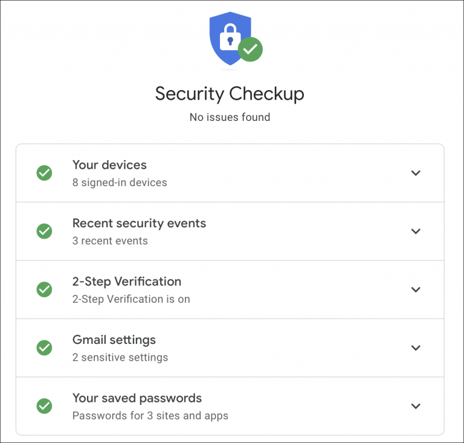

# Gestión de la seguridad en la red

## Gestionar la seguridad en la red

Como ya viste en la unidad de privacidad y seguridad, la seguridad en Internet engloba todas las medidas destinadas a proteger tus dispositivos, tus datos y tus comunicaciones frente a accesos no autorizados, fraudes, malware y otras amenazas digitales. También podría describirse como todas aquellas medidas y precauciones que deben ser tomadas para proteger todos los dispositivos informáticos, así como la red de internet que pueden ser afectados por delincuentes cibernéticos.

Para comprender mejor estas medidas, primero es importante entender qué es una red.

Una red es un conjunto de dispositivos conectados entre sí que pueden intercambiar información y compartir recursos. Estos dispositivos pueden ser ordenadores, teléfonos móviles, tablets, impresoras, televisores inteligentes, cámaras de videovigilancia o cualquier otro equipo conectado.

Internet es una gran red mundial formada por millones de redes interconectadas que utilizan protocolos comunes para comunicarse entre sí y permitir el intercambio de información.

Las redes pueden clasificarse, de forma general, en:

-   Redes públicas: accesibles por cualquier persona, como algunas redes Wi-Fi disponibles en cafeterías, aeropuertos o centros comerciales.

-   Redes privadas: aquellas cuyo acceso está restringido a usuarios autorizados, como la red de tu hogar o la de una organización.

La seguridad de una red no depende únicamente de la conexión a Internet. También es importante proteger los dispositivos conectados, mantenerlos actualizados y configurar adecuadamente los mecanismos de acceso.

Actualmente, además de ordenadores y teléfonos móviles, muchas viviendas cuentan con dispositivos inteligentes conectados a la red, como televisores, cámaras, asistentes de voz o sistemas domóticos. Todos ellos pueden convertirse en objetivos de ataques si no se configuran correctamente.

En los próximos apartados conocerás las principales amenazas que pueden afectar a una red y las medidas que puedes adoptar para proteger tus dispositivos, tu información y tu privacidad.

## Seguridad en las cuentas

Prácticamente todo el mundo en menor o mayor medida dispone de cuentas de usuarios en todas sus aplicaciones o servicios en la red. De entre las más conocidas están la cuenta de [Google](https://myaccount.google.com/security) y la de [Microsoft](https://account.microsoft.com/security). En estos dos enlaces podrás ajustar la seguridad necesaria para poder hacer uso de ellas con más garantías.

```{r, echo=FALSE, out.width='75%', fig.align='center', fig.cap='Algunos de los ajustes que puedes hacer de seguridad en google.'}

```

Además, recuerda que el resto de plataformas como Facebook, Linkedin, Instagram, X, Tiktok, etc. también ofrecen este tipo servicio para que puedas configurar tu seguridad y para sentirte más seguro.

## Contraseñas

Una contraseña, clave o password es un mecanismo de autenticación que permite verificar tu identidad para acceder a un servicio, aplicación o dispositivo. Su seguridad depende de que únicamente tú conozcas esa información. [@WIKI-password].

Cuando accedes a un servicio, este te solicita una contraseña. Si la contraseña introducida coincide con la registrada, se concede el acceso; en caso contrario, se deniega.

La contraseña sigue siendo uno de los métodos de autenticación más utilizados, pero también uno de los principales objetivos de los ciberdelincuentes. Por ello, es importante crear contraseñas que sean difíciles de adivinar o descubrir mediante ataques automatizados.

Cambio de paradigma en la creación de contraseñas (De las reglas antiguas a las recomendaciones modernas del NIST)

Durante muchos años se enseñó a crear contraseñas siguiendo reglas rígidas de:

-   Debes incluir números.

-   Utiliza una combinación de letras mayúsculas y minúsculas.

-   Incluye caracteres especiales. Ejemplos: \* ? ! \@ \# \$ / () {} = . , ; :

-   Una longitud mayor o igual a 8 caracteres.

-   No debes incluir espacios en blanco.

Sin embargo, las guías modernas, especialmente el estándar NIST SP 800‑63B y su actualización SP 800‑63‑4, han demostrado que estas prácticas no aumentan la seguridad real y, en muchos casos, empeoran la experiencia del usuario.

A continuación se muestra cómo ha cambiado el enfoque:

Práctica antigua (obsoleta):

-   Obligar a incluir números, símbolos y mayúsculas.

-   Prohibir espacios en blanco.

-   Usar trucos mnemotécnicos como M1C0ntr4s3ñ4!

-   Crear contraseñas cortas pero "complejas".

-   Cambiar la contraseña cada 30/60/90 días.

Problemas de este enfoque:

-   Los usuarios crean patrones predecibles (Casa2024!, Gato123?).

-   Las transformaciones son fáciles de romper por herramientas automáticas.

-   Las contraseñas se vuelven difíciles de recordar y se reutilizan más.

-   La complejidad artificial no detiene ataques modernos.

-   Los cambios periódicos generan fatiga y contraseñas más débiles.

Práctica moderna (según NIST SP 800‑63B / SP 800‑63‑4):

-   Priorizar la longitud sobre la complejidad.

-   Permitir y fomentar frases largas (passphrases).

-   Permitir espacios en blanco.

-   Evitar reglas de composición obligatoria.

-   Comprobar la contraseña contra listas de contraseñas filtradas o comunes.

-   Cambiar la contraseña solo si hay indicios de compromiso.

Ventajas del enfoque moderno:

-   Las passphrases son más fáciles de recordar y mucho más difíciles de romper.

-   La longitud aporta más entropía que cualquier símbolo obligatorio.

-   Se reducen los patrones predecibles.

-   Se mejora la usabilidad sin sacrificar seguridad.

-   Se evita la fatiga del usuario y la reutilización de contraseñas.

Ejemplo comparativo:

Antes (obsoleto):

-   M1Cu3nt4S3gur4!: Difícil de recordar, fácil de predecir, vulnerable a ataques offline.

Ahora (recomendado):

-   mi perro duerme en mi sofá azul: Mucho más larga, más resistente y más fácil de recordar.

Fuente oficial: NIST (National Institute of Standards and Technology) de Estados Unidos, un organismo público que desarrolla estándares y guías técnicas ampliamente utilizados en todo el mundo. En ciberseguridad, NIST es una referencia clave porque publica las Digital Identity Guidelines, que establecen buenas prácticas modernas para contraseñas, autenticación y gestión de identidades. [@NIST]

Por otro lado, actualmente, muchos servicios ofrecen claves de acceso (passkeys), una alternativa más segura que las contraseñas tradicionales. Cuando estén disponibles, es recomendable utilizarlas.

Pero ¿En qué consisten las passkeys?

Las [passkeys](https://www.eset.com/latam/blog/cultura-y-seguridad-digital/que-es-una-passkey-y-por-que-es-mejor-que-una-contrasena-tradicional/) son un método de autenticación moderno basado en criptografía de clave pública, que sustituye por completo a las contraseñas. En lugar de escribir una clave que puede ser robada, filtrada o adivinada, el dispositivo del usuario genera dos claves:

-   Una clave pública, que se guarda en el servicio.

-   Una clave privada, que nunca sale del dispositivo.

Para iniciar sesión, el servicio envía un desafío que solo la clave privada puede firmar. El usuario se autentica con un gesto sencillo:

-   Huella dactilar

-   Reconocimiento facial

-   PIN del dispositivo

-   Patrón de desbloqueo

La clave privada nunca se transmite, por lo que no puede ser robada en una filtración ni capturada por phishing.

Ventajas de las passkeys:

-   Resistentes al phishing: no se pueden engañar con webs falsas.

-   No se pueden filtrar: no existe una contraseña que robar.

-   No requieren recordar nada.

-   No dependen de reglas de complejidad ni cambios periódicos.

-   Funcionan en varios dispositivos mediante sincronización segura.

A su vez también han de ser fáciles de recordar, pero debes de huir de patrones poco seguros y fáciles de adivinar. A continuación, algunos ejemplos de contraseñas que nunca debes utilizar:

-   Qwerty

-   1234

-   Asdfg

-   Password

-   11111

-   Usar datos personales como la fecha de nacimiento, nombre mascota, etc.

En el siguiente enlace encontrarás una lista de las [contraseñas más comunes](https://nordpass.com/most-common-passwords-list/) que jamás deberías utilizar. Échale un vistazo por si alguna de esas se parece a la tuya.

Otras recomendaciones que debes tener siempre presente:

-   No compartas tus contraseñas con nadie.

-   No reutilices la misma contraseña en diferentes servicios.

-   Evita introducir tus contraseñas en dispositivos públicos o no confiables.

-   Puedes usar el gestor de contraseñas integrado en tu navegador, siempre que tu dispositivo esté protegido con PIN, biometría o contraseña. Los navegadores modernos cifran las contraseñas y son una opción segura para la mayoría de usuarios.

- Usar Security keys o [llave de seguridad](https://es.digitaltrends.com/computadoras/las-mejores-llaves-de-seguridad-usb/). Verás que son más adelante en esta misma unidad en el apartado de MFA (Multi-Factor Authentication)

-   Usa la [verificación en dos pasos](https://www.bbva.es/finanzas-vistazo/ciberseguridad/seguridad-en-internet/verificacion-en-dos-pasos.html) también conocida como autenticación doble y que verás en detalle más adelante en esta misma unidad.

-   Usa la [autenticación de factor múltiple](https://www.osi.es/es/actualidad/blog/2019/02/27/el-factor-de-autenticacion-doble-y-multiple), que también verás con más detalle en esta misma unidad.


La forma más segura y práctica de gestionar tus contraseñas es utilizar un gestor de contraseñas. Estos servicios generan claves robustas, las almacenan cifradas y te permiten usarlas sin tener que recordarlas todas. Además, reducen el riesgo de reutilizar contraseñas o de guardarlas en lugares inseguros.

Algunos gestores recomendados son:

-   [Bitwarden](https://bitwarden.com/).

-   [KeePassXC](https://keepassxc.org/).

-   [LastPass](https://www.lastpass.com/es/).

-   [Google passwords](https://passwords.google.com/).

-   [NordPass](https://nordpass.com/homepage/).

Los gestores de contraseñas modernos cifran tus claves localmente y solo se desbloquean con tu biometría, PIN o contraseña maestra, por lo que son una opción segura para la mayoría de usuarios.

Puedes usar herramientas online para entender la robustez de una contraseña o passphrase, pero no introduzcas nunca tu contraseña real en estos sitios. Úsalos solo para probar ejemplos o variantes que no utilices en ningún servicio.

Algunos recursos útiles:

-   [How Secure Is My Password](https://www.security.org/how-secure-is-my-password/): Estima el tiempo necesario para romper una contraseña mediante ataques offline.

-   [Password Check](https://password.kaspersky.com/): Analiza patrones débiles y longitud.

-   [Test contraseñas](https://www.ontek.net/test-contrasenas/): Mide la fortaleza aproximada de una clave.

-   [Hive Systems](https://www.hivesystems.io/blog/are-your-passwords-in-the-green): Muestra tablas actualizadas con tiempos estimados de crackeo según longitud y tipo de ataque.

Por otro lado si eres de las personas que te gusta tener todo bajo control puedes usar este servicio de Google llamado [Password Checkout](https://www.blog.google/technology/safety-security/google-password-checkup-cross-account-protection/) o estos otros llamados [Haveibeenpwned Passwords](https://haveibeenpwned.com/Passwords) para averiguar si alguna de tus contraseñas ha sido comprometida.

En un apartado como este donde se ha hablado de contraseñas desde sus diferentes ángulos no puede faltar entender cómo los ciberatacantes roban las contraseñas, aquí los 5 métodos más comunes:

-   Phishing: Te engañan con correos o webs falsas para que introduzcas tu contraseña.

-   Filtraciones de datos: Contraseñas expuestas por brechas en servicios que luego se reutilizan en otros sitios.

-   Fuerza bruta: Prueban millones de combinaciones por segundo hasta acertar.

-   Keyloggers: Malware que registra lo que escribes en el teclado.

-   Ingeniería social: Manipulación psicológica para que reveles tu contraseña sin darte cuenta.

A modo de conclusión, y para terminar, si tuviésemos que simplificar todo lo anterior en tres principios esenciales para crear contraseñas seguras, serían los siguientes:

-   Deben ser secretas: no deben compartirse con nadie bajo ninguna circunstancia.

-   Deben ser robustas: prioriza la longitud (idealmente 15 caracteres o más) y utiliza frases largas fáciles de recordar. No es necesario imponer reglas de complejidad (símbolos, números, mayúsculas), pero sí evitar patrones predecibles.

-   Deben ser únicas: usa una contraseña distinta para cada servicio. Nunca reutilices la misma clave en varias cuentas.

## Protocolo https

El Protocolo Seguro de Transferencia de Hipertexto (en inglés, Hypertext Transfer Protocol Secure o HTTPS) es la versión segura del protocolo HTTP y se utiliza para proteger la comunicación entre el navegador y los sitios web [@WIKI-https].

HTTPS emplea protocolos criptográficos TLS (Transport Layer Security) para crear una conexión cifrada entre el navegador y el servidor web. Gracias a este cifrado, la información intercambiada, como nombres de usuario, contraseñas, datos personales o información bancaria, viaja protegida frente a posibles interceptaciones por parte de terceros.

De este modo, aunque un atacante consiguiera interceptar la comunicación, únicamente obtendría datos cifrados que no podría interpretar ni modificar fácilmente.

Identificar si un sitio web utiliza HTTPS es muy sencillo. Basta con comprobar que la dirección web comienza por `https://`. Además, los navegadores modernos muestran información sobre la seguridad de la conexión al pulsar sobre el icono de información o seguridad situado junto a la dirección web. Al acceder a esta información, el navegador muestra detalles sobre la conexión segura, el certificado digital utilizado, las cookies almacenadas y otros aspectos relacionados con la configuración y seguridad del sitio web.

En este punto vamos a desmitificar la falsa sensación de confianza, que durante muchos años se ha divulgado en torno al candado en la barra de direcciones url del navegador. El candado hacía pensar que el contenido de la página era seguro. Lo cual no es cierto. Ya que los certificados de cifrado seguro los emiten terceros y los ciberestafadores pueden hacerse igualmente con uno. Sobre todo si se trata del certificado de dominio, que el único requisito es que la persona figure como contacto de administrador de dominio en el registro WHOIS de un nombre de dominio. Se trata del nivel más bajo de autenticación utilizado para validar certificados SSL.

Si quieres más información sobre los diferentes tipos de certificados lee el siguiente artículo [¿Cuál es la Diferencia Entre los Certificados SSL DV, OV y EV?](https://www.digicert.com/es/difference-between-dv-ov-and-ev-ssl-certificates)

Además algunos navegadores eliminaron el icono del candado porque el protocolo HTTPS se ha convertido en el estándar predeterminado de internet, haciendo que un indicador de "sitio seguro" sea redundante [@CONFIDENCIAL-candado].

En el enlace del Incibe [Qué hacer si el navegador nos dice que estamos intentando acceder a un sitio no seguro](https://www.incibe.es/ciudadania/blog/que-hacer-si-el-navegador-nos-dice-que-estamos-intentando-acceder-un-sitio-no) explican el aviso del navegador cuando nos advierte que se trata de un sitio no seguro, o lo que es lo mismo, que cuando el navegador se está refiriendo a que el sitio web tiene un protocolo "http: //" sin la "S" en lugar de "https: //" con la "S".

## Compras y transacciones

Para comprar por Internet debes tomar cuantas más precauciones mejor para evitar cualquier tipo de fraude. Los factores a tener en cuenta son los siguientes:

-   Evita sitios webs que no te inspiren confianza: Por ello solo debes compras a través de webs y aplicaciones oficiales.

-   Busca valoraciones y opiniones: Para ello dispones de las reseñas de Google maps, así como también de plataformas como [Trust Pilot](https://es.trustpilot.com/), [Gowork](https://es.gowork.com/), [Esopiniones](https://esopiniones.com/), [Local guides connect](https://www.localguidesconnect.com/) o [TripAdvisor](https://www.tripadvisor.es/).

-   Utiliza plataformas que identifican webs fraudulentas como [Fakeinet](https://fakeinet.com/), [Desenmascarame](https://desenmascara.me/) o [Dnstwist](https://dnstwist.it/) que disponen de un listado de posibles tiendas falsas.

-   Usa plataformas que verifican si la web ha sido hackeada, como [Scamadviser](https://www.scamadviser.com/) o [Urlscan](https://urlscan.io/).

-   Usa solo plataformas con protocolo HTTPS: Visto en el apartado anterior. Y recuerda que tener el candado no garantiza que la web sea legítima. Ya que los certificados de cifrado seguro los emiten terceros y los ciberestafadores pueden hacerse igualmente con uno.

-   Utiliza navegación privada: Así evitarás que se registre el historial de navegación.

-   Trata de usar pasarelas de pago: Evita en lo posible el uso de tarjetas de crédito y opta por una pasarela de pago, como puede ser [PayPal](https://www.paypal.com/es/home), te estarás garantizando la compra, además de disponer de protocolos de devolución del importe muy efectivos. Otra posibilidad es utilizar métodos de pago que incorporen protección al comprador, como tarjetas con sistemas de reclamación o servicios de pago intermediarios. Evita realizar transferencias directas, pagos mediante criptomonedas o sistemas de pago instantáneo cuando no conozcas plenamente al vendedor, ya que recuperar el dinero suele ser mucho más difícil.

-   En el caso de usar tarjeta de crédito usa siempre la misma o mejor aún utiliza tarjetas monedero o virtuales que facilitan los bancos con el fin de depositar solo en dinero con el que quieras hacer la compra y activa las notificaciones de operaciones de tu banco para detectar rápidamente cualquier cargo no autorizado.

- Conserva los justificantes de compra, correos electrónicos y facturas hasta confirmar que has recibido el producto correctamente.

-   Haz comprobaciones adicionales:

    - Comprueba desde cuándo existe el dominio de la página web. Muchas tiendas fraudulentas utilizan dominios registrados hace pocos días o semanas.
	
    - Analiza la dirección web para detectar pequeñas modificaciones del nombre de una marca conocida (por ejemplo, letras cambiadas, caracteres especiales o dominios poco habituales).

    -   Comprueba que la web está adherida a alguna plataforma de confianza online, como, por ejemplo, [Confianza Online](https://www.confianzaonline.es/). Se trata del único sello de calidad que cuenta con los reconocimientos de la Comisión Europea, el Instituto Nacional de Consumo o la Agencia Española de Protección de datos, además de estar respaldado por el Ministerio de Industria, Energía y Turismo. Y acredita que se cumple con los estándares de privacidad y protección de datos de los usuarios entre otros. También existe el [Certificado de comercio electrónico](https://www.aenor.com/certificacion/tecnologias-de-la-informacion/buenas-practicas-comercio-electronico) expedido por Aenor.

    -   Verifica que reciben análisis de seguridad periódicos realizados por plataformas como [McAfee Secure](https://www.mcafeesecure.com/certification).

    -   Asegúrate que disponen de certificados de autenticidad de la web y seguridad de las transacciones como los que ofrece [Norton secured](https://es.norton.com/internet-security) o [Comodo secure](https://www.comodo.com/home/internet-security/secure-shopping.php).

    -   También existen plugins como [Historial de precios](https://chrome.google.com/webstore/detail/historial-de-precios/fdeopiliemdomncemeibjpmccgmnkfig?hl=es-419&authuser=0) o [Alitools shopping assistan](https://chrome.google.com/webstore/detail/alitools-shopping-assista/eenflijjbchafephdplkdmeenekabdfb?hl=es-419&authuser=0) que verifican si el precio del producto o servicio que deseas adquirir ha sido inflando por algún tipo de campaña publicitaria, como es el caso del Black Friday en los que suelen subir los precios para justificar su descuento.

    -   En primera instancia desconfía de los productos o servicios a precios muy inferiores al real o con suculentos descuentos.

    -   Verifica que las reseñas sean legítimas con plataformas como [Amazon Review Checker](https://www.ratebud.ai/). Si quieres saber más sobre las campañas de reseñas fraudulentas lee esta entrada sobre [reseñas falsas](https://www.genbeta.com/actualidad/asi-incentivaban-a-crear-resenas-falsas-proveedores-chinos-baneados-amazon).

    -   Los sellos y certificados los encontrarás normalmente en la parte inferior de la web en forma de logos y debes hacer click en ellos para obtener más información sobre la entidad que los expide y la vigencia de éstos, ya que muchas webs fraudulentas utilizan sellos falsos.

```{r, echo=FALSE, out.width='75%', fig.align='center', fig.cap='Sellos y certificados de comercio online.'}
knitr::include_graphics("images/sellos-de-confianza-online.jpg")
```

Tienes disponible más información sobre compras online en [Compra segura en internet (Guía práctica)](https://www.aepd.es/sites/default/files/2019-09/guia-compra-segura-digital-web.pdf) y también dispones de esta entrada de [cómo detectar fraudes y análisis de una web falsa](https://www.osi.es/es/actualidad/blog/2018/08/08/detectando-fraudes-analisis-de-una-web-de-venta-falsa).

Por último ten siempre presente que, la inteligencia artificial ha facilitado la creación de tiendas fraudulentas con diseños muy profesionales, fotografías realistas, textos sin errores ortográficos e incluso asistentes virtuales capaces de responder automáticamente a tus preguntas. Por ello, no bases tu confianza únicamente en el aspecto visual de la página; verifica siempre la identidad del comercio mediante varios indicadores antes de realizar cualquier pago.

## Wi-Fi

Con respecto a la Wi-Fi nos encontramos ante dos escenarios: Wi-Fi propia y Wi-Fi ajena.

Uno de los peligros a los que más expuesto estás, es en el uso que haces de los puntos Wi-Fi ajenos. Ya que por lo general suelen ser puntos de accesos a la red gratuitos. En este escenario, existe el riesgo que aun tratándose de una red confiable puede haber sido hackeada por un tercero o que en primera instancia no provenga ni si quiera de una red de confianza. En cualquiera de los dos supuestos, tus dispositivos quedan expuestos y con ello, toda tu información sensible, a merced de ser espiado, robado o extorsionado.

Es por ello que debes tener la precaución de no hacer transacciones de ningún tipo, ni enviar datos sensibles. Es decir, usarla solo en caso de no te quede otra opción o en caso de tener que hacer cualquier búsqueda de carácter trivial.

Aun así, si usas una Wi-Fi pública estás expuesto entre otros ataques al conocido como Man-in-the-middle (Ataque de Intermediario en español), o el Packet sniffing. Si quieres más información al respecto visita el siguiente enlace [Tipos de pirateo que puedes sufrir en un Wifi público](https://as.com/meristation/2020/02/04/betech/1580856719_548183.html)

Es de suponer que si estas en casa con Wi-Fi propia, estas recomendaciones no son tan necesarias. Pero sí, que sería muy recomendable por tu parte, que tuvieses muy en cuenta las recomendaciones que tienes a tu disposición en el apartado de Router en este manual. Además, es conveniente que si no has establecido las capas de seguridad que se recomiendan en ese apartado, hagas una revisión de tu conexión Wi-Fi, por si tienes algún intruso y de ser así poder eliminarlo. Para ello tienes a tu disposición en la web del Incibe un recurso llamado [descubre y elimina a los intrusos de tu red wifi](https://www.osi.es/es/actualidad/blog/2019/09/25/descubre-y-elimina-los-intrusos-de-tu-red-wifi).

Lo más recomendable es que siempre que puedas navegues con cable en lugar de Wi-Fi.

## Plugins o extensiones

Las extensiones, también conocidas como extensiones o plugins, son pequeños programas que amplían las funcionalidades de una aplicación. En el caso de los navegadores web, permiten añadir nuevas características como bloquear publicidad, traducir páginas, gestionar contraseñas, comprobar la ortografía o mejorar la privacidad durante la navegación. Un ejemplo de estos es el archiconocido [adBlock](https://getadblock.com/), cuya función es la eliminar esos molestos anuncios de algunos portales webs.


Aunque resultan muy útiles, también pueden representar un riesgo para tu privacidad y seguridad. Muchas extensiones necesitan acceder al contenido de las páginas que visitas, por lo que una extensión maliciosa o comprometida podría recopilar información sobre tu actividad, modificar el contenido de las páginas web o mostrar publicidad no deseada.

Para reducir estos riesgos sigue estas recomendaciones:

- Instala únicamente las extensiones que realmente necesites. Cuantas menos tengas instaladas, menor será la superficie de exposición de tu navegador.

- Descarga las extensiones únicamente desde el repositorio oficial de tu navegador. Aunque estos repositorios realizan controles de seguridad, ninguna revisión garantiza por completo que una extensión sea segura.

- Comprueba quién es el desarrollador de la extensión, el número de instalaciones, las valoraciones de otros usuarios y la fecha de la última actualización. Una extensión abandonada o que lleva mucho tiempo sin actualizarse puede presentar vulnerabilidades.

- Revisa los permisos que solicita antes de instalarla. Desconfía si una extensión solicita acceso a información que no necesita para realizar su función. Por ejemplo, una extensión para cambiar el aspecto del navegador difícilmente necesitará acceder a todas las páginas que visitas.

- Mantén activadas las actualizaciones automáticas para recibir las correcciones de seguridad publicadas por sus desarrolladores.

 Revisa periódicamente las extensiones instaladas y elimina aquellas que ya no utilices.

Actualmente, la inteligencia artificial también está siendo utilizada por los ciberdelincuentes para crear extensiones fraudulentas con descripciones muy convincentes, generar reseñas falsas o copiar la apariencia de extensiones legítimas. Por ello, no bases tu confianza únicamente en las valoraciones o en el aspecto profesional de la página de descarga; verifica siempre el desarrollador y los permisos que solicita la extensión.

Algunos ejemplos de extensiones ampliamente utilizadas son los bloqueadores de publicidad, los gestores de contraseñas, los traductores automáticos, los correctores ortográficos o las herramientas para comprobar el historial de precios durante las compras por Internet. Instálalas siempre desde las tiendas oficiales de tu navegador y únicamente cuando procedan de desarrolladores de confianza.

```{r, echo=FALSE, out.width='75%', fig.align='center', fig.cap='Plugin traductor de Google seguido de otros plugin con diferentes funcionalidades.'}
knitr::include_graphics("images/plugin-navegador.png")
```

Si quieres ampliar tus conocimientos sobre las extensiones o plugins de los navegadores, puedes consultar la web de Incibe y su publicación [extensiones: Superpoderes para los navegadores](https://www.osi.es/es/actualidad/blog/2019/11/20/extensiones-superpoderes-para-los-navegadores).

## Descarga segura de aplicaciones y programas

Siempre que necesites instalar una aplicación o un programa, descárgalo desde la página web oficial del desarrollador o desde la tienda oficial de tu sistema operativo (como Microsoft Store, App Store o Google Play, según el dispositivo que utilices). Evita descargar software desde páginas de terceros, ya que pueden distribuir versiones modificadas, desactualizadas o que incorporen programas no deseados e incluso código malicioso. 

Aunque los antivirus constituyen una importante capa de protección, no son capaces de detectar todas las amenazas. Los ciberdelincuentes desarrollan continuamente nuevas técnicas para evitar su detección, por lo que no debes confiar únicamente en que un antivirus identificará cualquier archivo malicioso.

Algunos portales de descarga ofrecen programas muy populares, pero sustituyen el instalador original por otro propio que puede incluir publicidad, software no deseado o aplicaciones adicionales que se instalan si no prestas atención durante el proceso. 

Presta especial atención a los archivos ejecutables, como los que tienen extensión .exe en Windows, ya que son los encargados de instalar o ejecutar programas. Aunque la mayoría son completamente legítimos, también son el formato más utilizado para distribuir malware [@RZ-exe]. Antes de ejecutarlos:

- Comprueba que proceden de una fuente oficial.

- Verifica que el nombre del archivo coincide con el programa que deseas instalar.

- Analiza el archivo con tu solución de seguridad si tienes cualquier duda.

- Desconfía si el archivo te llega por correo electrónico, mensajería instantánea o redes sociales sin haberlo solicitado previamente.

También debes prestar atención durante el proceso de instalación. Lee cada pantalla del asistente y rechaza la instalación de programas adicionales, cambios en el navegador.

La inteligencia artificial también está siendo utilizada para crear páginas de descarga falsas prácticamente idénticas a las originales, generar campañas de phishing que suplantan a los desarrolladores de software o distribuir instaladores acompañados de instrucciones muy convincentes. Antes de descargar cualquier programa, comprueba que la dirección web corresponde realmente al sitio oficial y no te fíes únicamente del aspecto profesional de la página o de los resultados patrocinados de los buscadores.

Como norma general, si tienes dudas sobre el origen de un programa, es preferible no instalarlo hasta haber verificado su autenticidad. Unos minutos de comprobación pueden evitar la instalación de malware y la pérdida de información personal.

## Cierre de sesiones y uso de dispositivos ajenos

Cuando utilizas cualquier servicio en internet, como tu correo electrónico, redes sociales o plataformas bancarias, el primer paso para proteger tu información es iniciar sesión con tus credenciales.

Si estás utilizando tu propio móvil u ordenador, mantener la sesión iniciada es cómodo y seguro, siempre y cuando tu dispositivo esté protegido con un PIN, contraseña o huella dactilar. Sin embargo, la regla cambia por completo si utilizas un dispositivo ajeno o público (como el de un amigo, una oficina o una biblioteca). En estos casos, si olvidas cerrar la sesión, tus datos personales, mensajes y cuentas quedarán totalmente expuestos a la siguiente persona que use ese equipo.

Para evitar riesgos innecesarios, adopta estos dos hábitos esenciales de seguridad moderna:

- Usa siempre el Modo Incógnito: Cuando vayas a iniciar sesión en un dispositivo que no es tuyo, abre una ventana de navegación privada. La gran ventaja es que, en cuanto cierras esa ventana, el navegador destruye automáticamente tus contraseñas, cookies e historial, impidiendo que nadie pueda entrar a tus cuentas.

- Cierra sesión de forma remota si te despistas: Si te vas de un lugar y te asalta la duda de si dejaste tu cuenta abierta, no entres en pánico. Hoy en día, plataformas como Google, Microsoft o Meta (Facebook/Instagram) incluyen una sección de seguridad llamada "Dispositivos activos" o "Dónde has iniciado sesión" en los ajustes de tu cuenta. Desde allí, puedes pulsar un botón desde tu propio móvil para cerrar la sesión a distancia en cualquier otro equipo al instante.

Recuerda: Tu privacidad digital depende de dónde dejas tus llaves. No dejes nunca tus cuentas abiertas en territorio desconocido.

## 2SV (Two Step Verification) o Verificación en Dos Pasos

La mayoría de cuentas a día de hoy están configuradas para soportar lo que se conoce como SFA (Single Factor Authetication) o Factor de autenticación Simple, tamibén conocido como autenticación de un solo factor. Se trata del acceso a cuentas o servicios con el solo uso del usuario y una contraseña, algo que todo el mundo viene haciendo desde hace tiempo. Esto se ha vuelto en gran medida un gran riesgo, ya que si un tercero consigue hacerse con tu contraseña no tendrá ninguna dificultad para tomar el control.

Es por este motivo que cada vez más servicios están implementando lo que se conoce como 2SV (Two Step Verification) o Verificación en Dos Pasos. Este sistema funciona de la siguiente manera, justo después de introducir tu contraseña, se te envía una notificación de forma segura al dispositivo en el que hayas iniciado sesión, de manera que solo tienes que aprobar la notificación para realizar el inicio sesión. Algunos servicios como la [verificación en dos pasos de Google](https://support.google.com/accounts/answer/185839?co=GENIE.Platform%3DDesktop&hl=es) viene de manera nativa y tan solo tienes que activarla.

Como puedes ver, los dos pasos son:

1.  Usuario y contraseña: Que solo tú conoces.
2.  Notificación: Recibes un aviso en tu dispositivo.

```{r, echo=FALSE, out.width='75%', fig.align='center', fig.cap='Verificación en dos pasos.'}
knitr::include_graphics("images/verificación-dos-pasos.jpg")
```

Según la fuente que uses para informarte puede ser que termines sin comprenderlo del todo, ya que algunos medios también entienden la verificación en dos pasos (2SV) como un 2FA (segundo factor de autenticación). La diferencia es tan sutil que a veces es difícil de discernir, pero podría entenderse si ves el 2SV como una notificación que recibes y que apruebas sin más y la 2FA como un código que has de introducir. No obstante si quieres más información, en este enlace sobre [verificación en dos pasos](https://www.osi.es/es/actualidad/blog/2017/01/17/verificacion-en-dos-pasos-que-es-y-como-me-puede-ayudar) encontrarás más detalles, además de enlaces hacia las distintas plataformas y redes sociales más populares para que puedas implementarlo.

Es extremadamente recomendable que uses este sistema de verificación en la medida que puedas. Recuerda que de un modo u otro la mayoría de servicios y plataformas disponen de esta capa de seguridad. Normalmente las encontrarás en Ajustes y Seguridad.

## MFA (Multi-Factor Authentication) o Autenticación de Factores Múltiples

La autenticación de factor múltiple es una forma eficaz de aumentar la protección de las cuentas de usuario contra las amenazas más comunes, como los ataques de phishing, apropiación de cuentas, etc. Y se trata un método de control de acceso informático, en el que a un usuario, se le concede acceso al sistema solo después de que presente dos o más pruebas o factores diferentes de que es quien dice ser. Estas pruebas pueden ser diversas, como una contraseña, clave secundaria rotativa, un certificado digital instalado en el equipo, un token físico, etc. entre otros y son éstos lo que se conocen como factores de autenticación [@WIKI-multiple-factor].

Son tres los tipos de factores de autenticación:

-   Algo que sabes: Factor de conocimiento (contraseña, respuesta a una pregunta, un PIN).

-   Algo que tienes: Factor de posesión (tarjeta, smartphone, token hardware como las Security keys).

-   Algo que eres: Factor biométrico (huellas dactilares, escaneos de retina, reconocimiento facial, reconocimiento de voz o el comportamiento de un usuario).

Uno de los ejemplos de autenticación en dos factores más común es la acción que realizas cuando vas a sacar dinero de un cajero. Por un lado, metes la tarjeta (algo que tienes) y luego pones el PIN (algo que sabes). Esto es lo que se conoce como la autenticación en dos pasos o 2FA (segundo factor de autenticación), que es uno de los tipos más comunes de MFA y que a veces tiende a confundirse con la verificación en dos pasos 2SV (Two Step Verification) que puedes verla en esta misma unidad.

Otro ejemplo son los inicios de sesión en los que se necesita un código adicional que es gestionado a través de correo electrónico, SMS o llamadas telefónicas, como es el caso de algunas entidades bancarias, esto es lo que se conoce como OTP por sus siglas en inglés "One-Time Password" y en castellano "contraseña de uso único". Y en otros supuestos, aunque la plataforma disponga de dicho servicio necesitarás una aplicación externa como [Google Authenticator](https://support.google.com/accounts/answer/1066447?co=GENIE.Platform%3DAndroid&hl=es-419) o [Microsoft authenticator](https://www.microsoft.com/es-es/account/authenticator) entre otras y que se trata de una App de autenticación en dos pasos, que te genera el código adicional, que ha de ser utilizado inmediatamente ya que éste expira con el tiemplo.

También puedes hacer uso de autenticación de factores múltiples con lo que se conoce como Security Key o llave de seguridad. Se trata de un dispositivo hardware generalmente con conexión USB y necesitarás usar como segundo factor de autenticación una vez hayas introducido tu usuario y contraseña. En la publicación [las mejores llaves de seguridad usb](https://es.digitaltrends.com/computadoras/las-mejores-llaves-de-seguridad-usb/) encontrarás algunos de los más utilizados y recuerda siempre comprar en las plataformas oficiales o de confianza.

```{r, echo=FALSE, out.width='50%', fig.align='center', fig.cap='Autenticación de factores múltiples.'}
knitr::include_graphics("images/autenticación-factor-múltiple.jpg")
```

En la mayoría de los casos solo se combinan dos de estos tres factores, aunque existe la posibilidad de implementar los tres si se viene necesario. Más información en [Banco Santander stories](https://www.santander.com/es/stories/pon-una-capa-extra-de-seguridad-online-con-la-autenticacion-multifactor) y [Autenticación en dos factores vs autenticación en dos pasos](https://protegermipc.net/2016/03/18/autenticacion-en-dos-factores-vs-autenticacion-en-dos-pasos/).

## AntiBotnet

Una botnet es una red de dispositivos infectados con un programa malicioso (malware) que permite a un ciberdelincuente controlarlos de forma remota sin que sus propietarios sean conscientes de ello. Cada uno de estos dispositivos se conoce como "bot" o "equipo zombi".No existe un número mínimo de equipos para crear un botnet. Los botnets pequeños pueden incluir cientos de PCs infectados, mientras que los mayores utilizan millones de equipos [@INCI-botnet].

Aunque tradicionalmente las botnets estaban formadas principalmente por ordenadores personales, hoy también pueden incluir teléfonos móviles, routers domésticos, cámaras de videovigilancia, dispositivos inteligentes del hogar (IoT) y otros equipos conectados a Internet.

Los ciberdelincuentes utilizan estas redes para realizar diferentes actividades maliciosas, como enviar grandes cantidades de correo no deseado, lanzar ataques de denegación de servicio (DDoS), distribuir malware, ocultar el origen de otros ataques o utilizar los recursos de los dispositivos infectados sin autorización.

En muchos casos, una infección puede pasar desapercibida. No obstante, algunos indicios pueden ser un funcionamiento más lento del dispositivo, un consumo inusual de la conexión a Internet o un aumento de la actividad del equipo sin que estés utilizándolo.

Para reducir el riesgo de que tus dispositivos formen parte de una botnet:

- Mantén actualizado el sistema operativo y todas las aplicaciones.

- Actualiza periódicamente el firmware del router y de los dispositivos inteligentes.

- Cambia las contraseñas predeterminadas de los dispositivos conectados.

- Descarga aplicaciones únicamente desde fuentes oficiales.

- Utiliza un antivirus y mantén activada la protección frente a malware.

La inteligencia artificial está facilitando la automatización de campañas de phishing y otras técnicas empleadas para distribuir malware. Por ello, resulta aún más importante desconfiar de mensajes inesperados y mantener los dispositivos correctamente protegidos y actualizados.

Si sospechas que alguno de tus dispositivos puede estar comprometido, puedes utilizar el [servicios antibotnet](https://www.incibe.es/ciudadania/herramientas/servicio-antibotnet/) que identifican si desde tu conexión a internet se ha detectado algún incidente de seguridad relacionado u otras amenazas. Además en el siguiente enlace obtendrás una suite de rastreo y eliminación de Botnet [Servicio Antibotnet: Cleaners](https://www.incibe.es/ciudadania/servicio-antibotnet/cleaners).

## Bluetooth

Bluetooth es una tecnología de comunicación inalámbrica que permite conectar dispositivos cercanos, como auriculares, relojes inteligentes, teclados, altavoces o sistemas de manos libres del automóvil, etc. [@IONOS-bluetooh].

Las versiones actuales de Bluetooth incorporan mecanismos de seguridad mucho más robustos que los de hace años. No obstante, como cualquier tecnología inalámbrica, pueden aparecer vulnerabilidades que sean aprovechadas por ciberdelincuentes, especialmente si el dispositivo no está actualizado.

Entre los ataques más conocidos se encuentran:

- Bluejacking: envío de mensajes o contenido no solicitado a dispositivos cercanos.

- Bluesnarfing: acceso no autorizado a información del dispositivo aprovechando vulnerabilidades.

- Bluebugging: explotación de fallos de seguridad para obtener un cierto control sobre el dispositivo.

Aunque estos ataques son mucho menos frecuentes en dispositivos modernos correctamente actualizados, siguen siendo un ejemplo de los riesgos que pueden existir cuando el software presenta vulnerabilidades.

Además de estas técnicas de ataque, a lo largo de los años se han descubierto diversas vulnerabilidades en el propio protocolo Bluetooth y en su implementación en distintos sistemas operativos y dispositivos. Algunas de las más conocidas han recibido nombres como BlueBorne, KNOB, BIAS, BrakTooth o BLUFFS. Estos fallos de seguridad pueden permitir, en determinadas circunstancias, el acceso no autorizado al dispositivo, la interceptación de comunicaciones o la degradación de los mecanismos de protección. Por ello, resulta fundamental mantener siempre actualizado el sistema operativo y el firmware de los dispositivos que utilizan esta tecnología.

Para utilizar Bluetooth de forma segura:

- Mantén actualizado el sistema operativo y el firmware de tus dispositivos.

- Empareja únicamente dispositivos de confianza.

- Comprueba siempre el código de emparejamiento cuando se muestre en ambos dispositivos.

- Desactiva el modo visible o detectable cuando no sea necesario.

- Elimina de la lista los dispositivos que ya no utilices.

- Si no vas a utilizar Bluetooth durante un tiempo, especialmente en lugares públicos, puedes desactivarlo para reducir la superficie de exposición.

Recuerda que la mayoría de los ataques mediante Bluetooth requieren que el atacante se encuentre relativamente cerca del dispositivo, por lo que el riesgo suele ser menor que el de amenazas que actúan a través de Internet.

El riesgo que corres cuando tienes este servicio activado es que el dispositivo de un tercero acabe sincronizándose con el tuyo, con los riesgos expuestos. 
Si quieres más información visita el siguiente enlace [Diferencias entre los principales ataques por bluetooth: Bluesnarfing, Bluejacking y Bluebugging](https://computerhoy.com/noticias/tecnologia/diferencias-principales-ataques-bluetooth-bluesnarfing-bluejacking-bluebugging-1087867).

## NFC (Near field communication)

NFC (Near Field Communication) es una tecnología inalámbrica de muy corto alcance que permite intercambiar información entre dispositivos cercanos. Se utiliza habitualmente para realizar pagos sin contacto, identificarte mediante tarjetas o teléfonos móviles, acceder a edificios, validar billetes de transporte o leer etiquetas inteligentes [@IONOS-nfc].

Su reducido alcance, de apenas unos centímetros, constituye una de sus principales medidas de seguridad, ya que requiere que los dispositivos se encuentren muy próximos para poder comunicarse.

Aunque NFC es una tecnología segura cuando se utiliza correctamente, existen algunos riesgos que conviene conocer:

- Ejecución de programas maliciosos: ejecuta código en terminales Android simplemente acercando una etiqueta NFC al dispositivo.

- Pagos sin autorización: realiza compras por proximidad sin consentimiento.

- Transmisión de datos sin cifrar: lee datos como el nombre, apellidos, el número de la tarjeta y, en algunos casos, las transacciones realizadas.

- Copia de datos bancarios: con el empleo de Lectores con comunicación inalámbrica NFC.

Los sistemas actuales de pago mediante NFC incorporan mecanismos criptográficos y otras medidas de seguridad que dificultan considerablemente la copia de los datos bancarios. No obstante, cuando se trata de ciberseguridad, conviene mantener siempre una actitud prudente y seguir las recomendaciones de seguridad.

No obstante, debemos tener siempre presente que algunos ciberdelincuentes también utilizan técnicas de ingeniería social para convencerte de acercar tu teléfono a etiquetas NFC manipuladas o de instalar aplicaciones maliciosas tras leerlas. Antes de interactuar con una etiqueta NFC, asegúrate de que procede de una fuente de confianza.

Para utilizar NFC de forma segura:

- Mantén actualizado el sistema operativo de tu dispositivo.

- Activa NFC únicamente cuando vayas a utilizarlo, si no lo necesitas de forma habitual.

- No acerques tu dispositivo a etiquetas NFC de origen desconocido.

- Revisa periódicamente los movimientos de tus tarjetas y cuentas bancarias.

- Protege tu dispositivo mediante un método de desbloqueo seguro.

Si utilizas tarjetas con pago sin contacto y te preocupa una posible lectura accidental, puedes emplear fundas con protección RFID/NFC. No obstante, para la mayoría de las personas, el riesgo es reducido y mantener la tarjeta bajo tu control sigue siendo la medida de protección más importante.
