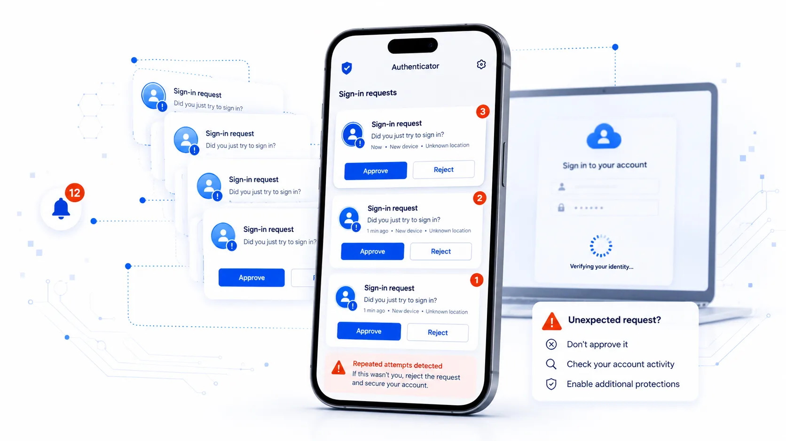

# Amenazas

## Principales amenazas 

Cuando utilizas un ordenador, teléfono móvil, tableta u otro dispositivo conectado a Internet estás expuesto a diferentes amenazas que pueden afectar al funcionamiento del dispositivo, acceder a tus cuentas, obtener información personal o económica, espiarte, engañarte o utilizar tus recursos sin tu autorización.

Algunas de estas amenazas utilizan malware, término que engloba diferentes tipos de programas maliciosos, como virus, troyanos, gusanos, programas espía (spyware) o ransomware, entre otros [@WIKI-malware]. Sin embargo, no todos los ataques necesitan instalar un programa malicioso en tu dispositivo. Un atacante también puede intentar engañarte para que reveles una contraseña, autorices una operación, accedas a una página fraudulenta o le proporciones determinada información.

En este punto es importante que sepas cuáles son todas y cada una de las amenazas a las que estas expuesto, si no tienes las herramientas y no adoptas una actitud prudente en el uso de los dispositivos y la red.

Por este motivo, conocer las amenazas no consiste únicamente en aprender sus nombres. Es más importante que entiendas cómo actúan, cómo pueden llegar hasta ti, qué señales pueden ayudarte a detectarlas y qué medidas puedes adoptar para reducir el riesgo.

Además, las amenazas evolucionan constantemente. Los ciberdelincuentes aprovechan nuevas tecnologías y servicios legítimos para mejorar sus ataques. La inteligencia artificial, por ejemplo, puede utilizarse para crear mensajes fraudulentos más convincentes, automatizar intentos de engaño, generar imágenes, voces o vídeos falsos y facilitar determinadas tareas relacionadas con un ataque. Esto no convierte a la inteligencia artificial en una amenaza por sí misma, pero sí puede hacer que algunos engaños sean más fáciles de producir, personalizar y escalar.

Un concepto importante a tener siempre presente, que comenzo con el exdirector de FBI Robert Mueller, cuando popularizó durante su mandato que, "solo hay dos tipos de empresas: las que han sido hackeadas y las que lo serán".Y que después, asimismo, fue parafraseado por expertos de la industria, como John Chambers (antiguo CEO de Cisco), quien afirmó que "existen dos tipos de empresas: las que han sido hackeadas y las que no saben que han sido hackeadas". Para posteriormente terminar acuñandose en la literatura técnica y en las conferencias sobre ciberseguridad, como principio fundamental, que se resume comúnmente con el enfoque de que la seguridad ya no busca la prevención absoluta (imposible de garantizar), sino la resiliencia, asumiendo que el incidente es inevitable y enfocando los esfuerzos en la detección temprana y la capacidad de respuesta y recuperación. Cristalizando finalmente la popular frase de que, «La cuestión no es si vas a ser atacado, sino cuándo vas a ser atacado», un recordatorio constante en la divulgación tecnológica de que nadie es completamente invulnerable en la red.

También debes tener presente que detrás de un ataque pueden existir actores con conocimientos, recursos y motivaciones muy diferentes. Pueden buscar obtener dinero, robar información, conseguir acceso a cuentas o dispositivos, espiar, causar daños o interrupciones, o perseguir otros objetivos. Para protegerte, generalmente es más útil comprender qué intentan hacer y cómo puedes reconocerlo que determinar qué tipo de atacante se encuentra detrás.

**¿Cómo puedes detectar un posible problema?**

No siempre es fácil saber si un dispositivo o una cuenta han sido comprometidos. Algunas señales que deberían llamar tu atención son:

* Una ralentización o un consumo de batería, datos o recursos difícil de explicar.

* Aplicaciones, extensiones o programas que no recuerdas haber instalado.

* Cambios inesperados en el navegador o en la configuración del dispositivo.

* Ventanas, anuncios, avisos o redirecciones que aparecen de forma inusual.

* Archivos que desaparecen, cambian de nombre o dejan de estar accesibles.

* Alertas de seguridad o intentos de inicio de sesión que no reconoces.

* Mensajes o publicaciones enviados desde tus cuentas sin tu intervención.

* Cambios de contraseña o de datos de recuperación que tú no has realizado.


Una de estas situaciones por sí sola no demuestra necesariamente que hayas sufrido un ataque, pero sí puede ser una señal para realizar comprobaciones.

**Reduce el riesgo**

No existe una herramienta capaz de protegerte frente a todas las amenazas. La protección depende de combinar las medidas de seguridad de tus dispositivos con unos hábitos adecuados.

* Mantén actualizados el sistema operativo, las aplicaciones y el navegador.

* Ten instalado un antivirus que mantenlo actulizado.

* Utiliza las funciones de seguridad y protección frente a malware disponibles en tus dispositivos.

* Descarga aplicaciones y archivos desde fuentes fiables.

* Utiliza contraseñas robustas y diferentes.

* Activa la autenticación en dos pasos siempre que sea posible.

* Realiza copias de seguridad periódicas de la información importante.

* Desconfía de mensajes, enlaces, archivos o solicitudes inesperadas, aunque aparentemente procedan de una persona o entidad conocida.

La inteligencia artificial hace todavía más importante esta última precaución: un mensaje bien escrito, una fotografía convincente o incluso una voz o un vídeo aparentemente reales ya no constituyen por sí solos una prueba de que quien está detrás sea realmente quien dice ser.

**Si hay menores en casa:**

* Control parental.

* Filtro web que restringe el acceso a contenidos no apto para menores.

**Los tres ciberataques que encabezan el ranking son:**

* Fraude de ventas.

* Vulnerabilidad de los equipos.

* Infecciones por malware que pretenden borrar datos, alterar las funciones básicas del equipo, espiar y/o robar datos.

Por último y a título informativo, las ciberamenazas vienen de la mano de perfiles a los que conoces como hacker, ciberdelicuente, pirata informático, etc. Pero cabe destacar que estos conceptos no son lo mismo. Por lo tanto:

* Ciberdelincuentes: Sus ataques se dirigen a objetivos concretos como escuelas, hospitales, instituciones, grandes empresas o bancos, entre muchos otros.

* Ciberterroristas y ciberyihadistas: Organizaciones terroristas que han desarrollado sus propias divisiones informáticas, aunque todavía no parecen ser capaces de desarrollar ciberataques sofisticados.

* Hackivistas: Grupos reivindicativos que actúan por razones ideológicas.

* Cibervándalos: Simplemente responden al deseo de armar revuelo y suelen ser ciberdelincuentes amateurs y poco cualificados.

* Hackers: son aquellas persona que tratan de solventar, paliar o informar sobre los problemas de seguridad encontrados en programas, servicios, plataformas o herramientas, pero sin ningún ánimo fraudulento si no todo lo contrario, con el ánimo de reducir la posibilidades de ataques por parte de ciberdelicuentes o cibervándalos. Dispones de más información en [hacker vs ciberdelincuente](https://www.incibe.es/aprendeciberseguridad/hacker-vs-ciberdelincuente) 

En los siguientes apartados conocerás con más detalle algunas de las principales amenazas, cómo funcionan, cómo pueden afectarte y qué puedes hacer para prevenirlas o reaccionar ante ellas.

## Virus
**Categoría: malware o programa malicioso**

Un virus informático es un tipo de malware diseñado para infectar archivos o programas. Dependiendo del virus, sus efectos pueden ir desde provocar alteraciones en el funcionamiento del dispositivo hasta modificar, eliminar o comprometer archivos e información [@WIKI-virus].

Aunque habitualmente se utiliza la palabra “virus” para referirse a cualquier programa malicioso, no todo el malware es un virus. Existen otros tipos de malware, como troyanos, gusanos, programas espía o ransomware, que conocerás más adelante.

Un virus puede llegar a tu dispositivo de diferentes formas. Algunas de las más habituales son:

* Abrir o ejecutar un archivo malicioso recibido por correo electrónico, mensajería instantánea u otros medios.

* Descargar programas, juegos, documentos u otros contenidos desde páginas o fuentes poco fiables.

* Instalar programas pirateados, modificados o procedentes de fuentes cuya legitimidad no puedes comprobar.

* Utilizar una memoria USB u otro dispositivo de almacenamiento previamente infectado.

* Descargar y ejecutar un archivo desde una página web maliciosa o después de pulsar un enlace engañoso.

* Aprovechar vulnerabilidades del sistema operativo o de aplicaciones que no se encuentran actualizadas.

Debes prestar especial atención a los archivos que te pidan ejecutar o instalar algo, incluso cuando aparentemente procedan de una persona o entidad conocida. Que un archivo tenga un nombre familiar, utilice un icono conocido o llegue acompañado de un mensaje convincente no garantiza que sea seguro.

Mantener actualizado tu dispositivo y sus aplicaciones, utilizar las protecciones de seguridad disponibles y evitar ejecutar archivos de procedencia dudosa reduce considerablemente el riesgo de infección.
	
## Gusanos informáticos
**Categoría: malware o programa malicioso**

Un gusano informático es un tipo de malware capaz de autorreplicarse y propagarse de un dispositivo a otro. Aunque comparte algunas características con los virus, existe una diferencia importante: un gusano puede propagarse automáticamente sin necesidad de infectar previamente otros archivos o programas  [@PANDA-gusano].

Esta capacidad permite que algunos gusanos se extiendan rápidamente entre dispositivos conectados a una misma red o incluso a través de Internet. Para conseguirlo pueden aprovechar vulnerabilidades de los sistemas o servicios de red, configuraciones inseguras u otros mecanismos de propagación.

Una vez que un gusano consigue acceder a un dispositivo, puede buscar otros sistemas a los que propagarse y repetir automáticamente el proceso. Esta actividad puede consumir recursos y afectar al funcionamiento de dispositivos y redes, pero sus consecuencias no se limitan a ello. Dependiendo del malware, también puede instalar otros programas maliciosos, modificar el sistema o facilitar otras acciones del atacante.

Para reducir el riesgo es especialmente importante que mantengas actualizado el sistema operativo y las aplicaciones, ya que las actualizaciones de seguridad corrigen vulnerabilidades que determinados gusanos pueden aprovechar para propagarse. También debes evitar abrir o ejecutar archivos de procedencia dudosa y mantener activadas las medidas de seguridad y protección de red disponibles en tus dispositivos.

Comparte vías de entradas con el virus visto justo en el punto anterior.

## Troyanos
**Categoría: malware o programa malicioso**

Un troyano o caballo de Troya es un tipo de malware que intenta engañarte presentándose como un programa, archivo o contenido legítimo para conseguir que lo descargues o ejecutes.

Su nombre procede precisamente de esta característica: aparentemente recibes o instalas algo inofensivo, pero en su interior se oculta software malicioso.

A diferencia de los gusanos, los troyanos no se caracterizan por propagarse automáticamente. Habitualmente necesitan que realices alguna acción, como instalar una aplicación, ejecutar un archivo o aceptar una falsa actualización.

Una vez ejecutado, las acciones que puede realizar dependen de cómo haya sido diseñado. Un troyano puede, entre otras cosas:

* Robar contraseñas, datos personales u otra información almacenada en tu dispositivo.

* Descargar e instalar otros programas maliciosos.

* Espiar determinadas actividades que realizas.

* Facilitar a un atacante el acceso remoto a tu dispositivo.

* Capturar información que introduces en determinadas aplicaciones o servicios.

* Utilizar tu dispositivo para realizar otras actividades maliciosas.

**¿Cómo puede llegar un troyano a tu dispositivo?**

El engaño es una parte fundamental de muchos ataques con troyanos. Algunas situaciones a las que debes prestar atención son:

* Archivos adjuntos o enlaces recibidos mediante correo electrónico, mensajería instantánea o redes sociales.

* Programas pirateados, [cracks](https://es.wikipedia.org/wiki/Cracking_(software)). o herramientas que prometen activar gratuitamente software de pago. 

* Aplicaciones descargadas desde páginas o fuentes cuya legitimidad no puedes comprobar.

* Falsas actualizaciones de programas o del navegador.

* Archivos que aparentan ser documentos, imágenes u otros contenidos pero que intentan ejecutar o instalar software.

* Páginas que te indican que necesitas instalar una aplicación, extensión o complemento para acceder a determinado contenido.

* Versiones falsas de programas y servicios populares.

Los ciberdelincuentes suelen aprovechar el interés por aplicaciones y servicios de actualidad para distribuir este tipo de malware. Esto también ocurre con la inteligencia artificial: puedes encontrar páginas, aplicaciones o extensiones que aparentan ofrecer acceso a herramientas de IA conocidas o nuevas funcionalidades, pero cuyo verdadero objetivo es conseguir que instales software malicioso.

Por ello, no confíes en un programa únicamente porque su página, nombre, logotipo o apariencia parezcan profesionales. Antes de instalarlo, comprueba que procede de la página oficial, de una tienda de aplicaciones de confianza o de otra fuente cuya legitimidad puedas verificar.

Mantén actualizado tu dispositivo y las herramientas de protección frente a malware. Si sospechas que has instalado un troyano, evita introducir contraseñas o información sensible hasta comprobar el dispositivo y, si existe la posibilidad de que tus credenciales hayan sido comprometidas, cambia las contraseñas desde otro dispositivo que consideres seguro.

Existen herramientas que analizan y limpian los troyanos que se esconden en tu dispositivo y a su vez previene futuros ataques troyanos. Una de estas herramientas es el [Trojan remover](https://www.avast.com/c-trojan-remover-tool).

## Ransomware o programa rescate
**Categoría: malware o programa malicioso**

El ransomware es un tipo de malware utilizado para impedirte acceder a tus archivos o sistemas y exigirte posteriormente el pago de un rescate. Una de sus formas más habituales cifra los archivos para que no puedas utilizarlos sin disponer de la clave necesaria para recuperarlos.

En las primeros estadios de este malware, para intimidar y engañar a las víctimas les hacian creer que habían incurrido en algún tipo de actividad delictiva, como incitación al odio, terrorismo o pederastia, entre otros.

Sin embargo, el ransomware ha evolucionado y el cifrado ya no es la única forma de extorsión. En algunos ataques, los ciberdelincuentes también roban información antes de cifrarla y amenazan con publicarla o utilizarla si no reciben el pago solicitado. Incluso pueden producirse casos de extorsión basados únicamente en el robo de información, sin necesidad de cifrar los archivos.

Por ello, una copia de seguridad puede ayudarte a recuperar información después de un ataque, pero no evita las consecuencias derivadas de que tus datos hayan sido robados.

```{r, echo=FALSE, out.width='75%', fig.align='center', fig.cap='Ransomware (Malware).'}
knitr::include_graphics("images/ransomware.jpg")
```

**¿Cómo puede llegar a tu dispositivo?**

Un ataque de ransomware puede comenzar de diferentes formas, entre ellas:

* Un archivo o enlace malicioso recibido por correo electrónico, mensajería instantánea u otros medios.

* La instalación de programas o archivos procedentes de fuentes poco fiables.

* El aprovechamiento de vulnerabilidades en sistemas o aplicaciones que no están actualizados.

* El uso de contraseñas o credenciales que previamente han sido robadas.

* Otro malware que ya se encuentre en el dispositivo y descargue posteriormente el ransomware.

Para reducir el riesgo, mantén actualizado el sistema operativo y las aplicaciones, utiliza las medidas de seguridad disponibles en tus dispositivos, desconfía de archivos y enlaces inesperados y realiza copias de seguridad periódicas de la información que consideres importante.

Procura que al menos una de esas copias no permanezca permanentemente accesible desde el dispositivo que estás protegiendo. Si un ransomware puede acceder a la copia de seguridad, también podría cifrarla o eliminarla.

**¿Qué debes hacer si sufres un ataque?**

Si descubres que tus archivos han sido cifrados o aparece una petición de rescate, desconecta el dispositivo de la red para intentar evitar que el ataque pueda extenderse a otros dispositivos o recursos conectados.

No se recomienda pagar el rescate. El pago no garantiza que recuperes tus archivos ni que los ciberdelincuentes eliminen la información que hayan podido robar.

Conserva la información relacionada con el ataque que pueda servir como evidencia y solicita ayuda especializada. En España puedes recurrir al servicio 017 de INCIBE y, cuando corresponda, denunciar los hechos ante las Fuerzas y Cuerpos de Seguridad.

En algunos casos existen herramientas capaces de descifrar los archivos afectados por determinadas familias de ransomware. Iniciativas como [No More Ransom](https://www.nomoreransom.org/) ofrecen herramientas gratuitas de descifrado y recursos de ayuda. Sin embargo, no todos los ransomware pueden descifrarse, por lo que debes comprobar si existe una herramienta específica para la variante que te ha afectado. Una de estas herramientas como los es [deshacer el cifrado del ransomware](https://www.avg.com/es-es/ransomware-decryption-tools) o [Descifradores de Ransomware Gratuitos](https://noransom.kaspersky.com/es/) de Kaspersky y la oficina de seguridad del internauta también pone a disposición otros recursos para combatir el ransomware en el siguiente artículo [¡No pagues ningún rescate si un ransomware ha cifrado tu información!](https://www.osi.es/es/actualidad/blog/2022/11/17/no-pagues-ningun-rescate-si-un-ransomware-ha-cifrado-tu-informacion).

Algunos de los ransomware más mediáticos son [CryptoLocker](https://es.wikipedia.org/wiki/CryptoLocker), [CryptoWall](https://es.wikipedia.org/wiki/Ransomware#CryptoWall) y [WannaCry](https://es.wikipedia.org/wiki/WannaCry), pero no son los únicos, además de estar siempre en constante evolución y lo que es peor aún, éstos últimos irán dejando paso a otros mucho más nuevos y peligrosos.

## Spyware o software espía
**Categoría: malware o programa malicioso**   

El spyware o software espía es un tipo de malware diseñado para recopilar información sobre ti o sobre la actividad de tu dispositivo sin tu conocimiento o consentimiento y transmitirla posteriormente a un tercero  [@AVAST-spyware].

La información que puede obtener depende de las capacidades del programa y del acceso que haya conseguido al dispositivo. Entre otras acciones, determinados programas espía pueden:

* Recopilar información sobre tu navegación y actividad en Internet.

* Obtener nombres de usuario, contraseñas y otros datos personales.

* Acceder a determinados archivos o comunicaciones.

* Realizar capturas de pantalla.

* Registrar las pulsaciones que realizas en el teclado.

* Obtener información sobre la ubicación del dispositivo.

* Acceder a la cámara o al micrófono si consiguen los permisos o privilegios necesarios.

Una de las técnicas que puede utilizar el software espía es el keylogging. Un keylogger permite registrar las pulsaciones realizadas en el teclado y puede utilizarse de forma maliciosa para intentar obtener contraseñas, mensajes, números de tarjetas u otra información que escribas.

Los keyloggers pueden ser programas o incluso dispositivos físicos conectados al equipo. No todo keylogger tiene necesariamente una finalidad maliciosa, pero su utilización sin tu conocimiento para obtener información supone un importante riesgo para tu privacidad y seguridad.

Otro tipo de malware relacionado con el robo de información son los infostealers o ladrones de información. Su objetivo es localizar y extraer información de interés almacenada en tu dispositivo y enviarla posteriormente a los ciberdelincuentes.

Un infostealer puede intentar obtener información como contraseñas guardadas en el navegador, cookies y datos de sesión, información de autocompletado, datos de determinadas aplicaciones, archivos o información relacionada con cuentas y servicios que utilizas.

El robo de cookies y datos de sesión resulta especialmente peligroso porque, en determinadas circunstancias, puede permitir que un ciberdelincuente acceda a una cuenta aprovechando una sesión que ya habías iniciado. Por este motivo, disponer de autenticación en dos pasos supone una protección muy importante, pero no debes considerar que te hace inmune frente a cualquier forma de robo de cuentas.

Los infostealers pueden distribuirse ocultos en programas aparentemente legítimos, software pirateado, falsas actualizaciones, archivos maliciosos o descargas fraudulentas. También pueden aprovechar el interés por programas y servicios populares para convencerte de que descargues el malware.

También existen aplicaciones conocidas como stalkerware que pueden utilizarse para vigilar de forma oculta la actividad de otra persona. Dependiendo de la aplicación y de los permisos obtenidos, pueden permitir conocer su ubicación, consultar comunicaciones u obtener otra información del dispositivo.

El spyware puede llegar a tu dispositivo oculto en una aplicación aparentemente legítima, mediante archivos maliciosos, programas descargados desde fuentes poco fiables o aprovechando vulnerabilidades. En algunos casos también puede instalarlo una persona que haya tenido acceso físico al dispositivo.

Precisamente porque su objetivo suele ser permanecer oculto, no siempre encontrarás señales evidentes de su presencia. Un consumo anormal de batería o datos, aplicaciones o permisos que no reconoces, cambios inesperados en la configuración o comportamientos extraños del dispositivo pueden justificar una comprobación, pero ninguno de estos indicios demuestra por sí solo que exista software espía.

**Para reducir el riesgo:**

* Mantén actualizado el dispositivo.

* Instala aplicaciones únicamente desde fuentes fiables.

* Revisa periódicamente las aplicaciones instaladas y los permisos que tienen concedidos.

* Protege el acceso al dispositivo mediante un método de bloqueo seguro.

* Evita instalar programas pirateados, cracks, falsas actualizaciones o aplicaciones cuya procedencia no puedas comprobar.

* Mantén activadas las herramientas de protección frente a malware disponibles en tu dispositivo.

Si sospechas que tu dispositivo ha sido infectado por un infostealer, no debes limitarte a eliminar el malware. Debes considerar que las contraseñas, cookies de sesión y otras credenciales almacenadas en el dispositivo podrían haber sido comprometidas. Utiliza otro dispositivo que consideres seguro para cambiar las contraseñas de las cuentas afectadas, cerrar las sesiones que permanezcan abiertas y revisar su actividad en busca de accesos que no reconozcas.


## Adware
**Categoría: malware o programa malicioso**

El adware es software diseñado para mostrarte publicidad, introducir anuncios en los contenidos que consultas o redirigirte hacia determinadas páginas. No todo programa que muestra publicidad es necesariamente malicioso, ya que existen aplicaciones y servicios legítimos que utilizan los anuncios como forma de financiación.

El problema aparece cuando el software muestra publicidad de forma intrusiva, realiza cambios que no esperabas, dificulta su eliminación, te redirige a otras páginas o recopila información sobre tu actividad sin ofrecerte suficiente información o control.

Algunas señales que pueden indicar la presencia de adware o de un programa potencialmente no deseado son:

* Aparición frecuente de ventanas o anuncios inesperados.

* Anuncios en lugares donde anteriormente no aparecían.

* Redirecciones a páginas que no pretendías visitar.

* Cambios en la página de inicio o en el buscador del navegador.

* Aparición de extensiones, barras de herramientas o aplicaciones que no recuerdas haber instalado.

* Notificaciones publicitarias constantes procedentes de páginas o aplicaciones desconocidas.

El adware puede llegar a tu dispositivo incluido junto con otros programas, especialmente cuando descargas aplicaciones desde fuentes poco fiables o instalas programas sin revisar las opciones que aparecen durante el proceso de instalación. También puede presentarse como una aplicación o extensión aparentemente útil.

Antes de instalar un programa o una extensión del navegador, comprueba su procedencia, revisa los permisos que solicita y evita instalar componentes adicionales que no necesitas. Descarga las aplicaciones desde sus páginas oficiales o desde tiendas y repositorios de confianza.

Si comienzas a recibir publicidad inesperada, comprueba las aplicaciones y extensiones instaladas y revisa qué páginas tienen permiso para enviarte notificaciones. Mantén actualizado el navegador y utiliza las funciones de seguridad y protección frente a sitios maliciosos disponibles en él.

No debes confundir el adware con toda la publicidad que encuentras en Internet ni con las comunicaciones comerciales que recibes por teléfono, correo electrónico o SMS. Que un anuncio te resulte molesto no significa que tu dispositivo esté infectado.

En España, si quieres reducir determinadas comunicaciones publicitarias de empresas a las que no hayas dado tu consentimiento, puedes utilizar servicios de exclusión publicitaria como la [Lista Robinson](https://www.listarobinson.es/) . Este tipo de servicio no detecta ni elimina adware de tus dispositivos.

Los navegadores y algunos servicios digitales también ofrecen opciones para limitar determinadas formas de seguimiento o personalización publicitaria. Existen además extensiones destinadas a bloquear contenidos y rastreadores como el es caso de  [Ghostery](https://www.ghostery.com/), aunque debes instalarlas únicamente desde fuentes fiables y revisar los permisos que solicitan.

## Malvertising     
**Categoría: malware o programa malicioso**

El término malvertising procede de la combinación de las palabras inglesas malicious y advertising y puede traducirse como publicidad maliciosa. Consiste en utilizar anuncios o mecanismos relacionados con la publicidad digital para dirigirte hacia contenidos o acciones maliciosas. 

Esta amenaza lo que hace es esconder malware para infectar los dispositivos en los espacios de publicidad de otras páginas webs, como son los banners de publicidad en las cabeceras o laterales tanto izquierdos como derecho de muchas de la web que a diario te encuentras en internet

A diferencia del adware, el malvertising no implica necesariamente que tengas instalado un programa que muestra publicidad en tu dispositivo. En este caso, el propio anuncio o el destino al que te conduce forma parte del engaño o del ataque [@INCIBE-malvertising].

Un anuncio malicioso puede intentar:

* Llevarte a una página web fraudulenta.

* Conseguir que descargues malware.

* Mostrarte falsas alertas de seguridad para convencerte de que instales un programa.

* Dirigirte a una página de phishing para obtener tus contraseñas u otros datos.

* Suplantar la página de descarga de un programa o servicio legítimo.

* Redirigirte a otros contenidos maliciosos o fraudulentos.

Una característica que debes tener en cuenta es que un anuncio malicioso puede aparecer incluso mientras visitas una página web legítima. Muchos sitios utilizan plataformas externas para gestionar sus espacios publicitarios, por lo que no debes considerar seguro un anuncio únicamente porque aparezca en una página que conoces y en la que confías.

En algunos ataques tendrás que pulsar sobre el anuncio para llegar al contenido malicioso. En otros casos pueden producirse redirecciones o intentos de aprovechar vulnerabilidades del navegador o de otros componentes del dispositivo. Por ello, es importante que mantengas actualizado el navegador, el sistema operativo y las aplicaciones.

Presta especial atención a los anuncios que te ofrecen descargar programas, supuestas actualizaciones, herramientas gratuitas o servicios populares. Los ciberdelincuentes pueden crear anuncios que imitan a empresas y servicios legítimos para dirigirte hacia páginas fraudulentas. También pueden aprovechar el interés por nuevas aplicaciones o servicios de inteligencia artificial para promocionar falsas herramientas o descargas que en realidad contienen malware.

Si un anuncio te ofrece un programa o servicio que te interesa, evita utilizar el propio anuncio como única referencia. Comprueba la dirección de la página y, cuando sea posible, accede directamente al sitio web oficial o utiliza una tienda de aplicaciones de confianza.

Las herramientas de bloqueo de anuncios y determinadas protecciones del navegador pueden reducir tu exposición a algunos de estos contenidos, pero no garantizan que estés protegido frente a todas las formas de publicidad maliciosa.

La vía de contagio por la que podemos caer víctimas de este ciberdelito, es como habrás podido ver, haciendo click en los anuncios en páginas webs.

## Scareware o rogueware
**Categoría: malware o programa malicioso**

El scareware y el rogueware son conceptos diferentes, aunque pueden aparecer relacionados dentro de un mismo engaño [@KASPER-scareware].

El scareware utiliza falsas alertas o advertencias, normalmente relacionadas con la seguridad, privacidad o funcionamiento de tu dispositivo, para hacerte creer que existe un problema que debes solucionar de forma inmediata. Por ejemplo, puede mostrar mensajes indicando que tu dispositivo está infectado por varios virus, que alguien está accediendo a tu información o que se han detectado graves problemas de seguridad.

Estas falsas advertencias pueden aparecer mientras navegas por Internet mediante páginas web, ventanas emergentes, anuncios o notificaciones del navegador. Para resultar más convincentes pueden imitar la apariencia de los avisos del sistema operativo, de un antivirus, del navegador o de una empresa conocida.

El scareware intenta que reacciones ante el supuesto problema y realices alguna acción, como:

* Descargar o instalar un programa.

* Comprar una supuesta herramienta de seguridad.

* Llamar a un falso servicio de soporte técnico.

* Acceder a una página fraudulenta.

* Conceder permisos a una aplicación o página web.

* Facilitar contraseñas, datos personales o información bancaria.

Una de las posibles consecuencias de este engaño es que termines instalando rogueware. Se denomina así al software engañoso que se presenta como una aplicación legítima o útil, frecuentemente como un antivirus, limpiador, optimizador u otra herramienta de seguridad.

Por ejemplo, una página puede mostrarte una falsa advertencia indicando que tu dispositivo tiene numerosos virus y ofrecerte inmediatamente un supuesto antivirus para eliminarlos. La falsa advertencia constituye el scareware, mientras que el falso programa de seguridad o falso antivirus que intenta que instales es el rogueware.

El rogueware puede inventar o exagerar problemas en tu dispositivo y posteriormente exigirte un pago para solucionarlos. También puede intentar recopilar información, modificar la configuración del dispositivo, mostrar publicidad no deseada o facilitar la instalación de otro malware.

Sin embargo, un ataque de scareware no tiene por qué terminar necesariamente con la instalación de rogueware. La falsa alerta también puede conducirte a una página de phishing, intentar que facilites datos bancarios, conseguir que realices un pago o hacer que contactes con un falso servicio de soporte técnico.

Debes desconfiar especialmente de las páginas que muestran mensajes como “Tu dispositivo está infectado” o que aparentan realizar un análisis antivirus y encontrar numerosas amenazas. Una página web no puede determinar mediante un supuesto análisis mostrado en pantalla que tienes una determinada cantidad de virus en tu dispositivo.

También debes prestar atención a las notificaciones del navegador. Algunas páginas intentan conseguir tu permiso para enviarte notificaciones y posteriormente lo utilizan para mostrar falsas alertas de seguridad. Aunque estos avisos aparezcan fuera de la página que estás visitando, no significa que procedan del sistema operativo o de tu antivirus.

**Para reducir el riesgo:**

* No instales una aplicación simplemente porque una página web te indique que tu dispositivo está infectado o tiene problemas.

* No llames a números de teléfono ni accedas a enlaces proporcionados por una alerta sospechosa.

* Descarga las herramientas de seguridad desde sus páginas oficiales o desde tiendas y repositorios de confianza.

* Revisa qué páginas tienen permiso para enviarte notificaciones.

* Comprueba quién desarrolla una aplicación y los permisos que solicita antes de instalarla.

* Mantén actualizado el sistema operativo, el navegador y las herramientas de seguridad.

Si encuentras una advertencia de este tipo, evita interactuar con ella. Cierra la página o el navegador y comprueba el estado del dispositivo utilizando las herramientas de seguridad que ya tengas instaladas o las funciones de protección del propio sistema operativo.

Si ya has instalado un programa sospechoso, evita realizar pagos o introducir información personal en él y comprueba el dispositivo con una herramienta de seguridad de confianza. Si además has facilitado contraseñas o datos bancarios, adopta las medidas necesarias para proteger las cuentas afectadas.

## Cryptojacking o minería maliciosa
**Categoría: malware o programa malicioso**

El cryptojacking o minería maliciosa de [criptomonedas](https://es.wikipedia.org/wiki/Criptomoneda) consiste en utilizar sin tu autorización los recursos de un ordenador, teléfono móvil u otro dispositivo para realizar operaciones relacionadas con la minería de criptomonedas.

A diferencia de otros ataques relacionados con criptomonedas, el objetivo del cryptojacking no es necesariamente robar las criptomonedas que puedas tener. El atacante intenta aprovechar la capacidad de procesamiento de tus dispositivos y la energía que consumen para obtener un beneficio económico. Por lo que es necesario aclarar, que no está tan focalizado en el robo directo de estas, sino, que se centra en el robo o secuestro de dispositivos de terceros con el fin de utilizarlos para minar estas criptomonedas, y a los que se le conocen también como dispositivos zombies [@cryptojacking].

Para conseguirlo puede utilizar malware que se instala o ejecuta en el dispositivo comprometido. También han existido ataques mediante código ejecutado desde páginas web y otras técnicas destinadas a utilizar los recursos del dispositivo sin que seas consciente de ello.

El cryptojacking puede afectar al rendimiento del dispositivo y provocar un mayor consumo de recursos y energía. Dependiendo del dispositivo y de la intensidad de la actividad, algunos indicios pueden ser:

* Una reducción del rendimiento difícil de explicar.

* Un uso elevado y prolongado del procesador o de la tarjeta gráfica sin que estés realizando tareas que lo justifiquen.

* Un aumento inusual de la temperatura del dispositivo.

* Ventiladores funcionando con mayor intensidad o durante más tiempo de lo habitual.

* Un consumo de batería superior al esperado en dispositivos portátiles.

Debes tener en cuenta que ninguno de estos síntomas demuestra por sí solo que estés siendo víctima de cryptojacking. Muchas aplicaciones legítimas, como videojuegos, programas de edición de vídeo, videollamadas o incluso determinadas páginas web, pueden utilizar temporalmente una gran cantidad de recursos.

Si observas un consumo elevado de recursos que no puedes explicar, puedes utilizar las herramientas del propio sistema operativo, como el Administrador de tareas de Windows o el Monitor de Actividad de macOS, para comprobar qué aplicaciones y procesos están utilizando el procesador, la memoria u otros recursos. No debes considerar malicioso un proceso únicamente porque tenga un consumo elevado; comprueba primero a qué aplicación pertenece.

**Para reducir el riesgo:**

* Mantén actualizado el sistema operativo, el navegador y las aplicaciones.

* Utiliza las funciones de protección frente a malware disponibles en tu dispositivo.

* Descarga programas y aplicaciones únicamente desde fuentes fiables.

* Evita instalar programas pirateados, cracks o aplicaciones cuya procedencia no puedas comprobar.

* Revisa las extensiones instaladas en el navegador y elimina aquellas que no reconozcas o que ya no necesites.

* Desconfía de archivos, aplicaciones o enlaces inesperados que intenten convencerte de que instales software.

Si detectas un programa o proceso sospechoso que podría estar realizando minería sin tu autorización, analiza el dispositivo con una herramienta de seguridad actualizada y comprueba las aplicaciones y extensiones instaladas. A continuación, tienes una lista para que puedas elegir la que mejor se adapte a tus necesidades:

- [NoMiner](https://chrome.google.com/webstore/detail/nominer-block-coin-miners/jfnangjojcioomickmmnfmiadkfhcdmd)

- [Adblock nocoin list](https://github.com/hoshsadiq/adblock-nocoin-list)

Señalar que [Microsoft Defender](https://www.microsoft.com/es-es/windows/comprehensive-security), que como ya sabréis es el antivirus que Windows trae por defecto ya incluye [protección contra el cryptojacking](https://www.microsoft.com/security/blog/2021/04/26/defending-against-cryptojacking-with-microsoft-defender-for-endpoint-and-intel-tdt/), aunque de momento solo está presente en la versión empresarial, es de suponer que con el paso del tiempo lo terminen incluyendo en las versiones de Windows Home.

El cryptojacking puede pasar desapercibido porque su objetivo suele ser aprovechar tus recursos durante el mayor tiempo posible. Por ello, un funcionamiento aparentemente normal del dispositivo no garantiza necesariamente que no exista actividad maliciosa.
    
## Plugins maliciosos
**Categoría: malware o programa malicioso**

Los plugins, complementos y extensiones son pequeños programas que añaden nuevas funciones a una aplicación o servicio. Puedes encontrarlos, por ejemplo, en navegadores web, gestores de contenidos y otras aplicaciones.

Para entender mejor qué son, piensa en las extensiones que puedes añadir a navegadores como Chrome, Firefox o Edge. Por ejemplo, existen extensiones para bloquear publicidad, traducir páginas web, gestionar contraseñas, comprobar la ortografía, guardar contenido, realizar capturas de pantalla, comparar precios o modificar la apariencia de las páginas. [Adblock](https://getadblock.com/), por ejemplo, es una extensión destinada al bloqueo de publicidad. 

Normalmente puedes consultar las extensiones que tienes instaladas desde el menú de configuración de tu navegador. En muchos navegadores también aparecen identificadas mediante un icono situado junto a la barra de direcciones. Pero las extensiones y los plugins no son exclusivos de los navegadores. Muchos programas los utilizan para añadir nuevas funciones. Por ejemplo, un programa de edición de imagen o vídeo puede incorporar plugins para añadir nuevos efectos y filtros; WordPress los utiliza para añadir funciones como formularios, tiendas en línea o herramientas de seguridad; y algunos videojuegos permiten instalar complementos para ampliar o modificar determinadas características del juego.

Aunque la mayoría tienen finalidades legítimas, un complemento malicioso puede aprovechar los permisos que le concedas para realizar acciones no deseadas. Dependiendo de sus características y permisos, podría recopilar información sobre tu navegación, acceder a determinados datos, modificar el contenido de las páginas que visitas, redirigirte a sitios fraudulentos, mostrar publicidad no deseada o facilitar otras actividades maliciosas.

En el caso de las extensiones del navegador debes prestar especial atención a los permisos que solicitan. Algunas necesitan acceder al contenido de las páginas web para poder realizar su función, pero debes preguntarte si los permisos solicitados son coherentes con lo que la extensión dice hacer. Por ejemplo, una herramienta con una función muy sencilla que solicita acceso a todas las páginas que visitas merece una revisión más cuidadosa.

El hecho de que una extensión o complemento se encuentre en una tienda oficial tampoco garantiza de forma absoluta que sea seguro. Las plataformas aplican mecanismos de revisión y pueden retirar software cuando detectan comportamientos maliciosos o incumplimientos, pero algunas amenazas pueden eludir inicialmente estos controles.

Además, una extensión que era legítima cuando la instalaste puede cambiar con el tiempo. Una actualización puede modificar sus funciones o los permisos que necesita y también puede producirse un cambio en el responsable de su desarrollo. Por ello, no debes valorar su seguridad únicamente en el momento de instalarla.

**Para reducir el riesgo:**

* Instala únicamente los complementos y extensiones que realmente necesites.

* Utiliza preferentemente las tiendas oficiales o fuentes de confianza, evitando descargar extensiones desde enlaces o páginas desconocidas.

* Comprueba quién desarrolla el complemento, cuál es su finalidad y si dispone de información suficiente sobre su funcionamiento antes de instalarlo.

* Revisa los permisos que solicita y valora si son razonables para las funciones que ofrece.

* Presta atención si una actualización solicita nuevos permisos que antes no eran necesarios.

* Revisa periódicamente las extensiones y complementos instalados y elimina aquellos que ya no utilices o que no reconozcas.

* Mantén actualizado el navegador, las aplicaciones y el sistema operativo.

Si una extensión comienza a producir comportamientos inesperados, como redirecciones, cambios en las páginas que visitas, publicidad inusual o modificaciones que no has realizado, revisa las extensiones instaladas y deshabilita o elimina las que resulten sospechosas.

Recuerda que instalar muchas extensiones innecesarias aumenta la cantidad de software que puede acceder a tu navegador y a tus datos. Una buena práctica es mantener únicamente aquellas que realmente utilizas y cuyos permisos comprendes.

## Phishing
**Categoría: engaños e ingeniería social**

El término phishing se utiliza para referirse a una de las técnicas de [ingeniería social](https://es.wikipedia.org/wiki/Ingeniería_social_(seguridad_informática)) más utilizadas por los ciberdelincuentes para engañarte y conseguir información confidencial de forma fraudulenta, como pueden ser tus contraseñas, datos personales o información bancaria. También puede utilizarse para conseguir que realices un pago, descargues un archivo malicioso o permitas, sin saberlo, el acceso a alguna de tus cuentas o dispositivos.

El phishing quizá sea una de las técnicas de ingeniería social más explotadas, tal como cuentan en este artículo [¿Sabías que los ataques de ingeniería social suponen el 93% de las brechas de seguridad?](https://www.osi.es/es/actualidad/blog/2019/12/04/sabias-que-los-ataques-de-ingenieria-social-suponen-el-93-de-las-brechas).

El ciberdelincuente, conocido como phisher, se hace pasar por una persona, empresa u organización de confianza mediante lo que se conoce como [suplantación de identidad o spoofing](#suplantación-de-identidad-o-spoofing). Para ello puede utilizar una comunicación que aparenta ser legítima a través del correo electrónico, SMS, aplicaciones de mensajería, redes sociales, llamadas telefónicas o páginas web fraudulentas.

Según INCIBE, el phishing consiste tradicionalmente en el envío de un correo electrónico en el que un ciberdelincuente suplanta a una entidad legítima, como un banco, una red social o una institución pública, con el objetivo de conseguir información privada, provocar un perjuicio económico o infectar el dispositivo. Para ello puede utilizar enlaces que conducen a páginas fraudulentas o archivos adjuntos maliciosos [@INCIBE-phishing].

Aunque el correo electrónico continúa siendo uno de los principales medios utilizados para este tipo de engaños, el phishing ha evolucionado y puede adoptar diferentes formas dependiendo del canal empleado. Cuando el fraude se realiza mediante SMS suele denominarse smishing, mientras que las llamadas telefónicas fraudulentas reciben habitualmente el nombre de vishing. También puedes encontrarte intentos de fraude mediante aplicaciones de mensajería, redes sociales o códigos QR que te dirigen a páginas fraudulentas.

**Spear phishing: ataques dirigidos específicamente a ti**

Existe una modalidad más específica denominada spear phishing, literalmente "pesca con arpón". A diferencia de las campañas de phishing genéricas, en las que un mismo engaño puede enviarse masivamente a un gran número de personas, el spear phishing se dirige específicamente contra una persona, grupo u organización [@PROOFPOINT-spear-phishing].

Para preparar estos ataques, los ciberdelincuentes pueden recopilar información pública sobre ti: tu profesión, lugar de trabajo, responsabilidades, intereses, contactos o información publicada en redes sociales. Con esos datos pueden elaborar un mensaje que resulte mucho más creíble y aumentar así las posibilidades de que abras un enlace, descargues un archivo o facilites información confidencial.

La inteligencia artificial generativa ha facilitado todavía más esta personalización. Un ciberdelincuente puede utilizar estas herramientas para redactar rápidamente mensajes convincentes, adaptarlos a diferentes idiomas y contextos o generar textos que imiten determinados estilos de comunicación. Por ello, que un mensaje esté correctamente escrito, utilice tu nombre o incluya información real sobre ti ya no es suficiente para considerarlo legítimo.

**¿Cómo puedes detectar un intento de phishing?**

No existe una única señal que permita identificar todos los intentos de phishing. Por ello, debes prestar atención al contexto del mensaje y a la combinación de diferentes indicios:

* La dirección web o URL: comprueba cuidadosamente la dirección de la página antes de introducir información sensible. Una página fraudulenta puede reproducir con gran precisión el aspecto de una web legítima. Ante cualquier duda, evita utilizar el enlace recibido y accede al servicio desde su aplicación oficial o escribiendo tú mismo la dirección en el navegador.

* El remitente: no te fijes únicamente en el nombre que aparece en pantalla. Comprueba la dirección completa desde la que se ha enviado el mensaje. Ten en cuenta, además, que una cuenta legítima puede haber sido comprometida, por lo que reconocer al remitente tampoco garantiza por sí solo que el mensaje sea seguro.

* Lo que te solicitan: presta especial atención si recibes inesperadamente una petición para introducir una contraseña, facilitar datos bancarios, compartir un código de verificación, realizar un pago o descargar un archivo.

* La urgencia o presión: muchos fraudes intentan que actúes rápidamente mediante mensajes como "tu cuenta será bloqueada", "debes pagar inmediatamente" o "solo tienes unas horas". Crear sensación de urgencia reduce el tiempo que tienes para pensar y comprobar la información.

* Las ofertas demasiado atractivas: premios, cupones promocionales, sorteos, inversiones con beneficios extraordinarios o productos a precios inusualmente bajos continúan utilizándose como reclamo para conseguir que accedas a enlaces fraudulentos o facilites información personal.

* Los archivos adjuntos: si recibes inesperadamente un documento o archivo, no lo abras únicamente porque aparentemente proceda de una persona o empresa conocida. Comprueba primero que realmente esperabas recibirlo y verifica su procedencia.

* Los códigos QR: un código QR puede ocultar la dirección a la que vas a acceder y dirigirte igualmente a una página fraudulenta. No debes considerar un enlace seguro simplemente porque se presente mediante un código QR.

```{r, echo=FALSE, out.width='75%', fig.align='center', fig.cap='Spear phishing Facebook.'}
knitr::include_graphics("images/spear-phishing-ejemplo.png")
```

```{r, echo=FALSE, out.width='75%', fig.align='center', fig.cap='Suplantación de identidad banco Santander posterior al phishing.'}
knitr::include_graphics("images/phishing.jpg")
```

**La ortografía ya no es una señal tan fiable**

Durante años, las faltas de ortografía, los errores gramaticales, las traducciones deficientes o una forma extraña de dirigirse a ti han sido indicadores habituales para detectar algunos mensajes de phishing. Estas señales todavía pueden aparecer, pero ya no debes confiar demasiado en ellas.

Las herramientas de inteligencia artificial generativa permiten producir textos fluidos, correctamente escritos y adaptados a prácticamente cualquier idioma. También facilitan la creación de mensajes personalizados y permiten modificar rápidamente su tono y estilo.

Por tanto, un correo perfectamente redactado también puede ser fraudulento. En lugar de confiar únicamente en cómo está escrito, presta más atención a quién te lo envía, qué acción intenta que realices, a dónde conduce el enlace y si la solicitud tiene sentido dentro del contexto habitual de tu relación con esa persona o servicio.

**Herramientas en la protección contra el phishing**

- Software anti-phishing: Software específico para la detección de phishing. [Phishing protection](https://www.phishprotection.com/). 

- Proveedores de email: Estos ofrecen protección contra el phishing a través de filtros y configuraciones con el objetivo detectar y frenar este tipo de fraude llevado a cabo por medio del correo electrónico. Para ello analizan de forma automatizada todos los emails, con el fin detectar links fraudulentos o dominios falsificados que tienen la intención de robar tus datos, protegiendo así a los usuarios de estos tipos de fraudes o estafas online. Esta protección puedes encontrarla prácticamente implementada en la mayoría de gestores de correos actuales.

- Antivirus:  Algunos antivirus traen implementado estándares contra el phishing como el [ESET anti-phising](https://support.eset.com/es/kb6380-activar-anti-phishing-en-productos-para-android-de-eset).

- Código anti-phishing: Existen plataformas webs que ofrecen este servicio. Consiste en un código o palabra clave que tú facilitas la primera vez a la web y que esta incluye en sus futuros email, verificando así la legitimidad del mismo. Un ejemplo de ello lo encontrarás en la plataforma de intercambio de criptomonedas [Binance código anti-phishing](https://academy.binance.com/es/articles/anti-phishing-code).

Navegadores: 

- [Firefox](https://www.mozilla.org/es-ES/firefox/) es uno de los navegadores que implementan grandes capas de seguridad siendo una de ellas la protección anti-phishing y que además, cuenta con [Mozilla support](https://support.mozilla.org/es/) y [Cómo protegerse del Phishing y del Malware con esta herramienta de Firefox](https://support.mozilla.org/es/kb/como-protegerse-del-phishing-y-del-malware-con-esta-herramienta-firefox).
    
- [Google Chrome](https://www.google.com/intl/es/chrome/) a su vez cuenta con los recursos ofrecidos por [Google safe browsing](https://safebrowsing.google.com/).

Si quieres saber más sobre los diferentes formatos de phishing, visita el siguiente enlace de la plataforma INCIBE, [Principales formas de estafa a través del email: phishing más comunes](https://www.incibe.es/empresas/blog/principales-formas-de-estafa-traves-del-email-phishing-mas-comunes). Y además, si también quieres ver otros ejemplos de phishing de bancos como CaixaBank, Santander o BBVA, pásate por la siguiente publicación titulada [Detectadas campañas de phishing y smishing suplantando a diversas entidades bancarias](https://www.incibe.es/ciudadania/avisos/detectadas-campanas-de-phishing-y-smishing-suplantando-diversas-entidades) de la Oficina de Seguridad del Internauta, donde te encontrarás capturas de pantallas, detalles y soluciones que te ayudarán a salir airoso de este peligroso ciberdelito.

Una técnica más reciente de phishing es el “Browser-in-the-browser” en la cual un ciberdelincuente o phisher simula una página de un servicio online para así introducir en esta una ventana emergente de inicio de sesión única, haciendo que el usuario crea que es una ventana de inicio de sesión legítima, como las que ya estamos acostumbrados a ver en muchas webs legítimas, e introduzca así sus credenciales. Más información en el siguiente enlace Browser-in-the-Browser: una nueva técnica de phishing casi indetectable.

Otros tipos de fraudes que pueden llegar a través de técnicas de phishing o smishing son las conocidas como el fraude de las suscripciones a servicios premium o de tarificación especial. Este fraude consiste en conseguir que los usuarios faciliten el número de teléfono o contesten a algún mensaje para que, sin dar  consentimiento explícito o ser conscientes de ello, nos suscriban a servicios de tarificación especial. Puedes leerlo en el siguiente artículo [¿Suscripciones premium por SMS? No, gracias](https://www.incibe.es/ciudadania/blog/suscripciones-premium-por-sms-no-gracias). El otro tipo es el ciberataque "Pass-the-Cookie" que consiste el robo de cookies de sesión con el que luego pueden acceder al servicio al que pertenece la cookie, puedes saber más en la siguiente entrada [Así es el nuevo ciberataque 'Pass-the-Cookie': qué es y cómo evitarlo](https://www.20minutos.es/tecnologia/ciberseguridad/ciberataque-pass-the-cookie-que-es-como-evitarlo-5163208/)

**La magnitud del problema y la evolución de las defensas**

El enorme volumen de mensajes fraudulentos que circula por Internet hace que una parte importante de la protección contra el phishing dependa también de sistemas automatizados capaces de detectar y bloquear amenazas antes de que lleguen hasta ti.

Un ejemplo de esta evolución puede observarse en las cifras publicadas por Google a lo largo del tiempo. En abril de 2020, durante la pandemia de COVID-19, Google señalaba que Gmail bloqueaba cada día más de 100 millones de correos electrónicos de phishing. Solo durante una de las semanas analizadas en aquel periodo, la compañía detectó diariamente alrededor de 18 millones de correos de phishing y malware relacionados específicamente con la COVID-19, además de más de 240 millones de mensajes de spam diarios vinculados con la pandemia. Según Google, sus sistemas bloqueaban entonces más del 99,9 % del spam, phishing y malware antes de que llegase a sus usuarios. Puedes leer el artículo en esta entrada [Protecting businesses against cyber threats during COVID-19 and beyond](https://cloud.google.com/blog/products/identity-security/protecting-against-cyber-threats-during-covid-19-and-beyond).

Años después, la escala de los sistemas automáticos de protección es todavía mayor. En mayo de 2026, Google indicó que las defensas de Gmail, apoyadas actualmente también en inteligencia artificial, continúan evitando que más del 99,9 % del spam, phishing y malware llegue a la bandeja de entrada y bloquean cerca de 15.000 millones de correos no deseados cada día de los cuales 602 millones son intentos de phishing. Puedes leer el artículo en esta entrada [Our fight against fraud: 5 ways we’re keeping you safer](https://blog.google/innovation-and-ai/technology/safety-security/scams-fraud-protection/).

También muestran algo especialmente importante para ti: aunque estas tecnologías consiguen detener una gran cantidad de amenazas, ningún filtro debe considerarse infalible. Que un mensaje haya llegado a tu bandeja de entrada sin ninguna advertencia no significa necesariamente que sea legítimo.


## Smishing
**Categoría: engaños e ingeniería social**

El smishing es una modalidad de phishing que utiliza principalmente mensajes SMS para engañarte. El término procede de la combinación de las palabras SMS y phishing. Técnicas similares también pueden desarrollarse mediante aplicaciones de mensajería instantánea, como WhatsApp o Telegram.

Al igual que ocurre con el phishing, se trata de una técnica de [ingeniería social](https://es.wikipedia.org/wiki/Ingeniería_social_(seguridad_informática)). El ciberdelincuente intenta hacerse pasar por una persona, empresa u organismo de confianza para conseguir que realices una determinada acción: facilitar información personal o bancaria, revelar contraseñas o códigos de verificación, realizar un pago, acceder a un enlace fraudulento o instalar una aplicación o archivo malicioso.

Estos mensajes suelen utilizar situaciones que buscan provocar una reacción rápida. Por ejemplo, pueden avisarte de un supuesto paquete pendiente de entrega, un problema con tu cuenta bancaria, una multa, un premio o una incidencia urgente. También pueden hacerse pasar por un familiar o una persona conocida que utiliza un número de teléfono nuevo y necesita dinero urgentemente.

La inteligencia artificial puede hacer que estos engaños sean más convincentes. Las herramientas de IA generativa permiten crear rápidamente mensajes correctamente redactados, adaptados a distintos idiomas y contextos e incluso personalizados a partir de información disponible sobre la víctima. Por este motivo, las faltas de ortografía o una redacción extraña pueden seguir siendo señales de alerta, pero un mensaje perfectamente escrito tampoco garantiza que sea legítimo.

Ante un SMS o mensaje inesperado, especialmente si te pide actuar con urgencia, facilitar información, realizar un pago o acceder a un enlace, detente y comprueba su autenticidad. Evita utilizar el enlace incluido en el propio mensaje y accede al servicio desde su aplicación oficial o escribiendo tú mismo la dirección de su página web. Si el mensaje parece proceder de una persona conocida y te solicita dinero o información sensible, verifica su identidad mediante otro canal antes de actuar.

Uno de los mayores riesgos de este tipo de ciberataque es el desconocimiento de los usuarios, ya que no esperan ser engañados a través de un mensaje de texto [@INCIBE-smishing].

Recuerda: que un mensaje conozca tu nombre, esté bien escrito o parezca proceder de una entidad o persona conocida no demuestra que sea auténtico.

```{r, echo=FALSE, out.width='35%', fig.align='center', fig.cap='BBVA smishing.'}
knitr::include_graphics("images/bbva-smishing.jpg")
```

```{r, echo=FALSE, out.width='35%', fig.align='center', fig.cap='Reemplazo app de mensajería.'}
knitr::include_graphics("images/reemplazo-app-mensajería.png")
```

## Quishing
**Categoría: engaños e ingeniería social**

Los códigos Quick Response (QR) o en castellano [código QR](https://es.wikipedia.org/wiki/C%C3%B3digo_QR) son códigos bidimensionales diseñados para almacenar información que puede ser interpretada rápidamente por un dispositivo. Su uso está ampliamente extendido y puedes encontrarlos en establecimientos, sistemas de pago, carteles, publicidad, entradas, documentos o comunicaciones electrónicas. Para utilizarlos normalmente basta con enfocar el código con la cámara de tu smartphone [@ESET-malware-qr].

Sin embargo, un código QR también puede utilizarse con fines maliciosos. Un ciberdelincuente puede crear o manipular un código para dirigirte a una página web fraudulenta, intentar obtener tus credenciales o datos bancarios, inducirte a realizar un pago o llevarte a descargar contenido potencialmente malicioso.

Cuando se utilizan códigos QR como parte de este ataque de [ingeniería social](https://es.wikipedia.org/wiki/Ingeniería_social_(seguridad_informática)), esta técnica se conoce habitualmente como quishing, término formado a partir de QR y phishing.

Una de sus particularidades es que el código oculta visualmente la dirección a la que te dirige. Además, el ataque puede producirse tanto en entornos digitales como físicos. Por ejemplo, puedes recibir un QR fraudulento mediante correo electrónico, SMS o mensajería instantánea, pero también encontrarte con una pegatina que contiene un código malicioso colocada encima del QR legítimo de un establecimiento, un parquímetro, un cartel o un sistema de pago.

La inteligencia artificial generativa puede contribuir a que estos engaños resulten más convincentes. Un ciberdelincuente puede utilizarla para elaborar mensajes, imágenes, documentos o páginas web fraudulentas con una apariencia más profesional y utilizarlos como contexto para conseguir que escanees el código. No obstante, la IA no convierte por sí misma el código QR en malicioso: el riesgo reside principalmente en el destino o la acción que se oculta detrás de él y en el engaño utilizado para conseguir que interactúes.

Por ello, trata un código QR con las mismas precauciones que un enlace. Antes de continuar, comprueba la dirección web que muestra tu dispositivo y presta especial atención si después de escanearlo te solicitan contraseñas, datos personales o bancarios, realizar un pago o descargar una aplicación o archivo.

Si el código pertenece supuestamente a una entidad o servicio conocido y tienes dudas, evita utilizarlo y accede directamente desde su aplicación oficial o escribiendo tú mismo la dirección web. En códigos situados en lugares públicos, comprueba también que no hayan sido cubiertos o sustituidos por una pegatina.

## Vishing
**Categoría: engaños e ingeniería social**

El vishing es una modalidad de [ingeniería social](https://es.wikipedia.org/wiki/Ingeniería_social_(seguridad_informática)) que utiliza principalmente las llamadas telefónicas para engañarte. El ciberdelincuente puede hacerse pasar por una persona, empresa u organismo de confianza con el objetivo de conseguir información personal o financiera, obtener contraseñas o códigos de verificación, inducirte a realizar una transferencia o conseguir que realices alguna otra acción que comprometa tu seguridad [@WIKI-vishing].

Para resultar convincente, el atacante suele construir una historia que justifique tanto la llamada como lo que posteriormente te solicita. Esta técnica de ingeniería social se conoce como pretexting o pretexto. Por ejemplo, puede hacerse pasar por el departamento de seguridad de tu banco y comunicarte que ha detectado una operación sospechosa que debes cancelar inmediatamente. La sensación de urgencia busca que actúes antes de comprobar si la llamada es auténtica.

Además, un ciberdelincuente puede utilizar técnicas de spoofing telefónico para falsificar el identificador de llamada y conseguir que en la pantalla de tu teléfono aparezca un número diferente al número real desde el que se está realizando la comunicación. Por tanto, que aparezca el nombre o número de una entidad conocida no garantiza por sí solo que realmente estés hablando con ella.

La inteligencia artificial generativa introduce un riesgo adicional. Las tecnologías de síntesis y clonación de voz pueden generar audio que imite la voz de otra persona y utilizarse como apoyo en determinados ataques de ingeniería social. Por ello, reconocer la voz de un familiar, una persona conocida o un supuesto representante de una organización tampoco debe considerarse una prueba suficiente de identidad.

Imagina, por ejemplo, que recibes una llamada en la que una persona que parece tener la voz de un familiar te explica que ha sufrido una emergencia y necesita urgentemente que le envíes dinero. En una situación de este tipo, evita actuar únicamente basándote en la voz o en la información que aparece en la pantalla. Finaliza la llamada y contacta tú directamente con esa persona utilizando un número que ya conocías. También puedes comprobar la situación mediante otro familiar o un canal diferente.

Mantén especial precaución cuando una llamada inesperada te solicite contraseñas completas, PIN, códigos de verificación recibidos por SMS o mediante una aplicación, datos bancarios, transferencias de dinero o la instalación de aplicaciones. Tampoco compartas un código de verificación simplemente porque la persona que te llama afirme que lo necesita para confirmar tu identidad o cancelar una operación.

Si alguien afirma llamar desde tu banco, una empresa o una institución y tienes dudas, finaliza la llamada. Después, contacta tú con la organización mediante su aplicación oficial, su página web o un número de teléfono obtenido de una fuente fiable. No utilices automáticamente el número que te haya proporcionado la propia persona que te llamó.

En definitiva, frente al vishing no confíes únicamente en el número que aparece en pantalla, en la voz de quien llama o en la información que esa persona conoce sobre ti. Presta atención principalmente a lo que te está pidiendo y verifica la identidad por un canal independiente antes de proporcionar información sensible, realizar pagos o seguir instrucciones que puedan comprometer tu seguridad.

## Spam o correo no deseado
**Categoría: engaños e ingeniería social**

El spam hace referencia principalmente a mensajes no solicitados que se envían, normalmente de forma masiva, a un gran número de personas. Es habitual encontrarlo en forma de publicidad, promociones, ofertas o mensajes comerciales que no has solicitado [@WIKI-spam].

Sin embargo, spam y correo malicioso no significan exactamente lo mismo. Un mensaje de spam puede ser simplemente publicidad no deseada, mientras que un correo malicioso tiene como objetivo engañarte, obtener información, robar credenciales, distribuir malware o conseguir que realices alguna acción que comprometa tu seguridad, en lo que también se conoce como [phishing](#phishing)

La inteligencia artificial generativa puede facilitar la creación de mensajes fraudulentos mejor redactados y adaptados a diferentes idiomas, situaciones o destinatarios. Por este motivo, un correo sin faltas de ortografía, bien escrito o con una apariencia profesional no tiene por qué ser legítimo.

Cuando recibas un mensaje inesperado, presta especial atención a lo que intenta conseguir de ti. Desconfía si te presiona para actuar inmediatamente, introducir una contraseña, facilitar un código de verificación, realizar un pago, descargar un archivo o acceder a un enlace.

Antes de utilizar un enlace incluido en un correo, comprueba su destino. Si el mensaje afirma proceder de un servicio que utilizas, puedes acceder directamente mediante su aplicación oficial o escribiendo tú mismo la dirección que conoces, en lugar de utilizar el enlace recibido.

Ten también precaución con los archivos adjuntos inesperados, incluso cuando aparentemente procedan de alguien conocido. Si tienes dudas sobre un mensaje, verifica su autenticidad mediante otro canal antes de realizar la acción que te solicita.

Si se trata de correo no deseado, utiliza la opción para marcarlo como spam. Si tu servicio de correo dispone de una función específica para denunciar phishing o mensajes fraudulentos, utilízala cuando corresponda.

Recuerda que el aspecto del mensaje, el nombre del remitente o una redacción impecable no demuestran por sí solos que un correo sea legítimo. Valora el contexto, comprueba quién te está solicitando la acción y verifica por otra vía cualquier petición sensible o inesperada.

En torno a este concepto también aparece el SPIM (SPam over Instant Messaging), que en castellano viene a ser, spam a través de mensajería instantánea. Y también el SPIT (SPam over Internet Telephony) o spam de VoIP, también hablaríamos de spam pero esta vez a través de llamadas telefónicas no solicitadas. Puedes leer más en el siguiente artículo [Hablemos de ciberseguridad – III – Spam, SPIM y SPIT](https://www.iniseg.es/blog/ciberseguridad/hablemos-de-ciberseguridad-iii-spam-spim-y-spit/).

## Baiting 
**Categoría: engaños e ingeniería social**

El baiting, término procedente de la palabra inglesa bait (cebo), es una técnica de [ingeniería social](https://es.wikipedia.org/wiki/Ingeniería_social_(seguridad_informática)) en la que un ciberdelincuente utiliza algo atractivo o aparentemente interesante para despertar tu curiosidad y conseguir que realices una determinada acción [@baiting].

Una de sus formas más conocidas consiste en utilizar dispositivos de almacenamiento extraíbles, especialmente memorias USB, que se dejan deliberadamente en lugares donde puedan ser encontrados. El dispositivo puede incluso incluir una etiqueta o referencia diseñada para aumentar tu curiosidad.

Si encuentras una memoria USB desconocida y la conectas a tu dispositivo, podrías exponerte a diferentes riesgos. Por ejemplo, el dispositivo puede contener archivos o programas maliciosos preparados para que los abras o ejecutes, o aprovechar otras técnicas para comprometer el equipo. Por este motivo, no conectes a tus dispositivos memorias USB u otros dispositivos de almacenamiento de procedencia desconocida.

Antes de conectar un dispositivo desconocido, descargar un archivo o instalar un programa atraído por una oferta o contenido especialmente llamativo, pregúntate de dónde procede y por qué tienes acceso a él. Si desconoces su origen o no puedes comprobar que sea fiable, evita interactuar con él.

Si quieres saber cómo minimizar el riesgo por contagio a través de USBs lee el siguiente artículo [Cómo conectar con seguridad un pendrive que puede tener virus](https://www.redeszone.net/tutoriales/seguridad/que-hacer-pendrive-virus/).

## Quid pro quo
**Categoría: engaños e ingeniería social**

Quid pro quo es una locución latina que hace referencia a un intercambio en el que se recibe algo a cambio de proporcionar otra cosa. En el ámbito de la [ingeniería social](https://es.wikipedia.org/wiki/Ingeniería_social_(seguridad_informática)), un ciberdelincuente utiliza este principio para ofrecerte un supuesto beneficio o servicio a cambio de información o de que realices una determinada acción [@quid-pro-quo].

Por ejemplo, puede ofrecerte un regalo, dinero, acceso gratuito a un programa o servicio de pago, una promoción exclusiva o asistencia técnica. A cambio, puede solicitarte información personal, credenciales, datos bancarios o códigos de verificación, o pedirte que instales una aplicación, modifiques alguna configuración o le permitas acceder a tu dispositivo.

Una modalidad especialmente relevante es el falso soporte técnico. El atacante puede hacerse pasar por un supuesto especialista que se ofrece a solucionar gratuitamente un problema de tu ordenador o smartphone. Durante el proceso puede intentar convencerte para que instales un programa de acceso remoto, le facilites información o realices determinadas acciones que terminen proporcionando acceso a tu dispositivo o a tus cuentas.

Esta técnica puede utilizar diferentes canales, como llamadas telefónicas, correo electrónico, SMS, aplicaciones de mensajería instantánea, redes sociales o páginas web. Por tanto, no debes identificarla por el medio utilizado, sino por la propuesta de intercambio que plantea.

La inteligencia artificial generativa puede facilitar la creación de ofertas, conversaciones o mensajes más convincentes y personalizados. Por ello, que una propuesta esté bien redactada, conozca determinados datos sobre ti o parezca profesional no demuestra que sea legítima.

Desconfía especialmente de ofertas inesperadas en las que alguien te prometa gratuitamente un producto, servicio o beneficio a cambio de información sensible, códigos de verificación, la instalación de programas o acceso a tu dispositivo. Antes de aceptar, comprueba quién realiza la oferta y utiliza los canales oficiales de la organización para verificarla.

## Usurpación o robo de identidad 
**Categoría: Suplantación, usurpación y acceso a tus cuentas**
  
El robo de identidad, usurpación de identidad es la apropiación de la identidad de una persona: hacerse pasar por esa persona, asumir su identidad ante otras personas en público o en privado, en general para acceder a ciertos recursos o la obtención de créditos y otros beneficios en nombre de esa persona. Esto que sucede en el mundo analógico también ocurre en el mundo digital [@WIKI-usurpacion].
  
  La manera que tienen los ciberdelincuentes de usurpar la identidad suele ser a través de los siguientes:
  
  - Robo masivo de cuentas de email por medio de métodos de hacking.
  
  - Por medio de Phishing, Smishing o Vishing.
  
  - Dejando tú cuenta abierta en sitios públicos.
  
  - Usando Wi-Fi de terceros creadas para ese fin.
  
  - Software espía o troyanos.
  
  La usurpación de identidad permite a los delincuentes hacerse con información personal de sus víctimas, para luego con ella interceptar aún más datos de otros perfiles, a quienes engañan con el fin de extorsionar u obtener lucro económico e incluso a veces realizar actividades delictivas.
  En caso de ser víctima de esta amenaza debes tener en cuenta lo siguiente:
  
  - Guarda los mensajes de texto e emails que recibas.
  
  - Haz capturas de pantalla.
  
  - Revisa todas tus redes sociales.
  
  - Avisa a tus contactos sobre el perfil falso.
  
  - Infórmalo dentro de la aplicación. Todas las plataformas y redes sociales disponen de un apartado de Suplantación de identidad en las cuentas.
  
  - Si es de carácter grave denúncialo a las autoridades.
  
  - Si es posible cancela cuenta.
  
En el [Incibe](https://www.incibe.es) tienes una publicación que se llama [¡Me han secuestrado mi cuenta!](https://www.incibe.es/blog/me-han-secuestrado-mi-cuenta) de una historia real donde puedes ver cómo gestionar este tipo de ataques.
  
  Algunas de las formas en que lo ciberdelicuentes se hacen con nuestras cuentas:
  
  - [Cómo evitar ser víctima del fraude del sí y la suscripción a servicios premium](https://www.incibe.es/linea-de-ayuda-en-ciberseguridad/casos-reales/como-evitar-ser-victima-del-fraude-del-si-y-la-suscripcion-servicios-premium)
  
  - [Robo de cuenta de Whatsapp](https://twitter.com/RavePrivacy/status/1754584579002830975?t=FD4dA9kbzOCHB39-6-86Eg&s=09)

## Suplantación de identidad o Spoofing  
**Categoría: Suplantación, usurpación y acceso a tus cuentas**

La [suplantación de identidad](https://es.wikipedia.org/wiki/Suplantaci%C3%B3n), también conocida en determinados contextos como spoofing, consiste en hacerse pasar por otra persona, empresa, organismo o servicio para ganarse tu confianza y conseguir que realices una acción que normalmente no harías.

El ciberdelincuente puede falsificar o imitar diferentes elementos para hacer que una comunicación parezca legítima. Por ejemplo, puede utilizar una dirección de correo electrónico similar a la de una empresa, manipular el identificador que aparece en una llamada telefónica, crear una página web que imite a la de tu banco o utilizar un perfil falso en una red social.

El objetivo suele ser conseguir información personal o bancaria, contraseñas y códigos de verificación, lograr que realices un pago, conseguir acceso a tus cuentas o instalar software malicioso en tu dispositivo.

Algunas formas habituales de suplantación son:

- Suplantación del correo electrónico: recibes un mensaje que aparenta proceder de una persona u organización conocida.

- Suplantación telefónica: una llamada muestra un número o una identidad que aparenta ser legítima.

- Suplantación de páginas web: accedes a una web falsa diseñada para parecerse a la original y conseguir que introduzcas tus datos.

- Suplantación en redes sociales y mensajería: alguien crea un perfil falso o utiliza una cuenta comprometida para hacerse pasar por una persona conocida.

- Suplantación de servicios o dispositivos en una red: se utilizan técnicas para hacer que una comunicación o un sistema parezca proceder de un origen legítimo.

**La IA hace más convincentes las suplantaciones**

La inteligencia artificial generativa permite crear mensajes, imágenes, voces y vídeos falsos con un elevado grado de realismo. Esto facilita que un ciberdelincuente pueda imitar la forma de escribir de una persona, generar una voz similar a la suya o crear imágenes y vídeos manipulados, incluidos los conocidos como deepfakes.

Por ejemplo, puedes recibir un audio que aparentemente procede de un familiar pidiéndote dinero con urgencia, una videollamada en la que alguien parece ser una persona conocida o un correo redactado imitando el estilo habitual de una empresa o compañero de trabajo.

Por este motivo, que una comunicación tenga una apariencia convincente no significa que sea auténtica.

**¿Cómo puedes protegerte?**

- Desconfía de las comunicaciones inesperadas que te pidan dinero, contraseñas, códigos de verificación o información personal.

- No te fíes únicamente del nombre, número de teléfono, dirección de correo electrónico, fotografía, voz o imagen que aparece en una comunicación.

- Evita acceder a servicios importantes desde enlaces recibidos por mensajes. Cuando sea posible, utiliza la aplicación oficial o escribe tú mismo la dirección del servicio.

- Ante una petición sensible o poco habitual, verifica la identidad utilizando otro canal de comunicación.

- Si recibes una petición urgente de una persona conocida, contacta directamente con ella utilizando un número o medio que ya conocieras anteriormente.

- Nunca compartas contraseñas ni códigos de verificación recibidos para acceder a tus cuentas.

- Activa la autenticación en dos pasos y utiliza claves de acceso o passkeys cuando estén disponibles.

- Mantén actualizados tus dispositivos y aplicaciones.

Recuerda que el spoofing no siempre implica que hayan accedido a la cuenta o al dispositivo de la persona o entidad suplantada. En muchos casos, el ciberdelincuente simplemente manipula la apariencia de una comunicación para conseguir que confíes en ella.

Ante la duda, no actúes siguiendo las instrucciones recibidas. Comprueba primero quién está realmente al otro lado.

## SIM Swapping
**Categoría: Suplantación, usurpación y acceso a tus cuentas**

El SIM Swapping, es la técnica que usan los ladrones digitales que se basa en duplicar la tarjeta SIM del móvil de sus víctimas. Así, pueden acceder a toda su información personal y, sobre todo, pueden usarlas en la verificación a través de un SMS por medio del móvil que suelen pedir los bancos cuando se opera a través de Internet y algunas otras plataformas online.

Por ello, aunque la mayoría de las apps de los bancos son muy seguras, con protocolos complejos para las claves de acceso, cifrado de las comunicaciones y teclados virtuales, los timadores digitales son capaces de saltarse la seguridad por medio de una técnica llamada [ingeniería social](https://es.wikipedia.org/wiki/Ingeniería_social_(seguridad_informática)), que consiste en el engaño a través de técnicas de persuasión y manipulación psicológica. Sin embargo, en lugar de timar directamente a las víctimas, el SIM swapping se consigue por medio de un engaño a los dependientes de las tiendas de telefonía.

Por lo tanto, una vez que el ciberdelicuente se hace con tus credenciales del tipo que sea, tales como contraseñas bancarias o de perfiles sociales, como Facebook, Instagram, etc. o cualquier otra credencial privada, no va a tener problemas para obtener el SMS de verificación.

Cabe destacar que cuando se es víctima de este asalto digital, al obtener la duplicación de la SIM por parte del atacante, tu tarjeta queda sin uso, por lo tanto pierdes la cobertura de llamadas y la conexión de internet [@PANDA-sim].

Por lo tanto, es importante que sigas estas recomendaciones para no ser víctimas del SIM Swapping:

- Utiliza una contraseña adicional o [doble autentificación](https://www.incibe.es/ciudadania/blog/el-factor-de-autenticacion-doble-y-multiple): reconocimiento facial, por voz, PIN adicional, [Google authenticator](https://play.google.com/store/apps/details?id=com.google.android.apps.authenticator2&hl=es&gl=US), etc.

- No compartas demasiada información en Internet. Cuantos más datos haya sobre ti en la web, más fácil será para los malos chantajearte, timarte o conseguir otras cosas tuyas, como contraseñas, cuentas bancarias, etc.

- No almacenes todo en tu móvil, no es una caja fuerte. Es un dispositivo electrónico que no es 100% seguro.

- Exige a tu operador móvil que refuerce sus sistemas de seguridad cuando se trate de operaciones en tu nombre.

- Los mensajes a través de aplicaciones de mensajería tipo WhatsApp, Telegram, Line, etc. son más seguros que los SMS, ya que están encriptados y éstos últimos no, haciéndolos más susceptibles.

- No vincules tus cuentas bancarias a tu cuenta o teléfono.

- No le des nunca a nadie tu código PIN. ¡Nunca!.

- Instala un antivirus o solución de seguridad para evitar que puedan robar o acceder a tus datos personales.

Desde el [Instituto nacional de Ciberseguridad](https://www.incibe.es/) y a través de este [video](https://www.youtube.com/watch?v=fIaodow_nxw) podrás obtener más información sobre que es el SIM Swaping.

## Secuestro de sesión o Session Hijacking
**Categoría: Suplantación, usurpación y acceso a tus cuentas**

El [secuestro de sesión](https://es.wikipedia.org/wiki/Secuestro_de_sesi%C3%B3n), también conocido como Session Hijacking, es un ataque mediante el cual un ciberdelincuente consigue apropiarse de una sesión que ya tienes iniciada en una página web o servicio digital y utilizarla como si fueras tú.

Cuando accedes a servicios como tu correo electrónico, una red social o una tienda online, normalmente no tienes que introducir tu contraseña cada vez que cambias de página. El servicio mantiene tu sesión mediante determinados identificadores, frecuentemente almacenados en cookies, que permiten reconocer que ya te has autenticado.

Si un atacante consigue obtener o utilizar uno de estos identificadores de sesión, en determinadas circunstancias puede acceder a tu cuenta sin conocer tu contraseña. Es como si alguien consiguiera una copia temporal de la acreditación que demuestra ante el servicio que ya has iniciado sesión.

Esto es especialmente importante porque cambiar la contraseña no siempre invalida inmediatamente todas las sesiones que ya estaban abiertas. Por ello, ante la sospecha de un acceso no autorizado, también debes revisar y cerrar las sesiones activas.

¿Cómo puede producirse? Un ciberdelincuente puede intentar obtener información relacionada con tus sesiones mediante diferentes métodos, entre ellos:

- Software malicioso instalado en tu dispositivo.

- Extensiones del navegador maliciosas o comprometidas.

- Páginas web fraudulentas diseñadas para robar información.

- Vulnerabilidades en páginas web o aplicaciones.

- Dispositivos compartidos, perdidos o robados en los que hayas dejado una sesión iniciada.

- Determinados ataques sobre comunicaciones que no estén correctamente protegidas.

El simple hecho de conectarte a una red Wi-Fi pública no significa que puedan secuestrar automáticamente tus sesiones. Sin embargo, debes mantener las precauciones, especialmente ante redes falsas o manipuladas y avisos de seguridad del navegador.

**¿Cómo puedes protegerte?**

- Mantén actualizado el sistema operativo, el navegador y las aplicaciones.

- Instala aplicaciones y extensiones del navegador únicamente desde fuentes de confianza y elimina las que no necesites.

- No ignores los avisos de seguridad o certificados que muestre tu navegador.

- Evita dejar sesiones abiertas en ordenadores o dispositivos compartidos.

- Bloquea tus dispositivos mediante PIN, contraseña, huella u otro mecanismo de protección.

- Activa la autenticación en dos pasos y utiliza claves de acceso o passkeys cuando estén disponibles.

- Revisa periódicamente las sesiones y dispositivos conectados a tus cuentas importantes.

- Desconfía de enlaces, archivos y páginas de inicio de sesión que recibas de forma inesperada.

Recuerda: un ciberdelincuente no siempre necesita conocer tu contraseña para utilizar una cuenta. Proteger la sesión una vez iniciada es tan importante como proteger las credenciales utilizadas para acceder a ella.

## Ataques contra la autenticación multifactor
**Categoría: Suplantación, usurpación y acceso a tus cuentas**

La [autenticación multifactor (MFA)](#mfa-multi-factor-authentication-o-autenticación-de-factores-múltiples) añade una capa adicional de seguridad a tus cuentas. Además de una contraseña, puede solicitarte un código temporal, una confirmación desde una aplicación, una característica biométrica o una llave de seguridad.

Activarla reduce considerablemente el riesgo de que alguien acceda a tu cuenta únicamente porque haya conseguido tu contraseña. Sin embargo, utilizar autenticación multifactor no significa que una cuenta sea imposible de comprometer. Los ciberdelincuentes han desarrollado diferentes técnicas para intentar engañarte y conseguir que tú mismo autorices el acceso.

Algunas de las técnicas que puedes encontrarte para superar la autenticación multifactor son:

- Phishing: una página falsa imita el servicio legítimo y te solicita tanto la contraseña como el código de verificación. El atacante puede intentar utilizar esos datos inmediatamente para acceder al servicio real.

- Fatiga de MFA o MFA bombing: después de obtener tu contraseña, el atacante genera repetidamente solicitudes de autorización en tu teléfono esperando que termines aceptando alguna por error, cansancio o confusión.

- Ingeniería social: alguien puede hacerse pasar por el servicio de soporte técnico, tu banco u otra entidad para pedirte un código de verificación o convencerte de que apruebes una solicitud de acceso.

- Robo de sesión: en determinados ataques, el objetivo no es obtener directamente el segundo factor, sino conseguir una sesión que ya ha sido autenticada y utilizarla para acceder a la cuenta.

- Ataques relacionados con SMS: los códigos recibidos mediante mensajes SMS pueden estar expuestos a determinados fraudes relacionados con el número de teléfono, como la duplicación fraudulenta de la SIM o SIM swapping.

- Malware: un dispositivo comprometido puede permitir el robo de información, credenciales o datos relacionados con una sesión iniciada.

De otro lado la inteligencia artificial generativa puede facilitar la creación de mensajes de phishing personalizados, conversaciones convincentes o imitaciones de voz destinadas a generar confianza y urgencia.

La tecnología puede hacer más convincente el engaño, pero la regla de protección continúa siendo sencilla: un código o una solicitud de autorización que recibes para demostrar tu identidad es para ti, no para entregárselo a otra persona.

**¿Cómo puedes protegerte?**

- Activa la autenticación multifactor siempre que esté disponible. Aunque existen ataques contra ella, continúa proporcionando una protección adicional muy importante frente al uso de contraseñas robadas.

- Nunca comuniques a otra persona los códigos de autenticación que recibas.

- No apruebes una solicitud de acceso que tú no hayas iniciado, aunque aparezca repetidamente.

- Si recibes varias solicitudes de autorización inesperadas, recházalas y revisa inmediatamente la seguridad de tu cuenta.

- Utiliza preferentemente los mecanismos de autenticación más resistentes al phishing que ofrezca el servicio, como las claves de acceso (passkeys) o las llaves físicas de seguridad.

- Si utilizas códigos temporales, una aplicación de autenticación suele ser preferible al SMS cuando el servicio te permite elegir.

- Protege también los métodos de recuperación de la cuenta, especialmente tu correo electrónico y número de teléfono.

- Revisa periódicamente los dispositivos y sesiones que tienen acceso a tus cuentas.

Si recibes una solicitud de autenticación inesperada, considérala una señal de alerta: recházala y comprueba la seguridad de tu cuenta.

```{r, echo=FALSE, out.width='75%', fig.align='center', fig.cap='Fatiga por MFA.'}

```

## Voice hacking o clonación de voz
**Categoría: Suplantación, usurpación y acceso a tus cuentas**

El voice hacking hace referencia al uso de técnicas destinadas a imitar, manipular o utilizar fraudulentamente la voz de una persona. Una de las amenazas más relevantes actualmente es la clonación de voz mediante inteligencia artificial, que permite generar audios sintéticos que reproducen las características de la voz de una persona y hacen que parezca que está diciendo algo que nunca ha dicho.

Para intentar crear una imitación, un ciberdelincuente puede utilizar muestras de voz obtenidas de vídeos, redes sociales, pódcast, mensajes de audio u otras grabaciones. El resultado puede utilizarse para hacerse pasar por ti o por alguien de tu confianza.

Los ciberdelincuentes pueden utilizar estas técnicas para:

- Hacerse pasar por un familiar o una amistad y solicitarte dinero urgentemente.

- Suplantar a una persona de una empresa, banco u organización para intentar conseguir información confidencial.

- Crear mensajes de audio falsos atribuidos a una persona real.

- Combinar la voz sintética con llamadas telefónicas, phishing y otras técnicas de ingeniería social.

- Intentar engañar a determinados sistemas que utilicen la voz como mecanismo de identificación.

También pueden existir riesgos para dispositivos y servicios controlados mediante la voz, como asistentes virtuales y determinados dispositivos conectados, especialmente cuando una orden de voz puede realizar acciones sensibles sin verificaciones adicionales.

La IA hace que escuchar una voz conocida ya no sea suficiente. La tecnología tras la inteligencia artificial generativa ha facilitado la creación de voces sintéticas cada vez más convincentes. Por ello, reconocer la voz de una persona ya no debería considerarse una prueba suficiente de que realmente estás hablando con ella.

Además, un ataque no necesita ser perfecto. Si recibes una llamada inesperada en la que aparentemente un familiar te dice que ha sufrido un accidente y necesita dinero urgentemente, la presión emocional puede hacer que prestes más atención a la situación que a pequeños errores en la voz.

**Para reducir el riesgo**

- Desconfía de las llamadas o mensajes de voz inesperados que soliciten dinero, contraseñas, códigos de verificación o información personal.

- Si la petición es sensible o poco habitual, cuelga y contacta tú directamente con esa persona utilizando un número que ya conocieras.

- No confíes únicamente en reconocer una voz como método para comprobar la identidad de alguien.

- Ante situaciones de riesgo, haz alguna pregunta cuya respuesta conozcan tú y la persona que supuestamente está llamando y que no pueda obtenerse fácilmente de Internet.

- Puedes acordar con tu familia una palabra o procedimiento de verificación para situaciones de emergencia. Evita que esa información sea pública o fácilmente deducible.

- No compartas códigos de autenticación aunque quien te los solicite parezca tener la voz de una persona conocida.

- Limita, cuando sea razonable, la cantidad de información personal que haces pública y revisa la privacidad de tus contenidos.

- Protege los dispositivos y servicios controlados mediante voz y configura mecanismos adicionales de confirmación para operaciones sensibles cuando estén disponibles.

Si recibes una llamada alarmante de alguien que parece ser un familiar o una persona conocida, evita actuar únicamente basándote en la voz. Interrumpe la comunicación y verifica la situación por otro medio.

Recuerda: que una voz suene auténtica no demuestra que lo sea. Con la inteligencia artificial, la verificación mediante otro canal es cada vez más importante.

Puedes ampliar información en el artículo de INCIBE [¿Qué es el voice hacking?](https://www.incibe.es/ciudadania/blog/que-es-el-voice-hacking).

## Video hacking y deepfake
**Categoría: Suplantación, usurpación y acceso a tus cuentas**

El video hacking hace referencia al uso de diferentes técnicas para manipular, falsificar o utilizar de forma fraudulenta imágenes y vídeos con el objetivo de engañar, suplantar la identidad de una persona o difundir información falsa.

La inteligencia artificial generativa ha aumentado considerablemente las posibilidades de este tipo de manipulación. Mediante técnicas de generación y edición de imágenes y vídeo es posible modificar el rostro de una persona, alterar sus movimientos o crear contenidos en los que aparentemente hace o dice algo que nunca ocurrió. Estos contenidos manipulados o generados artificialmente se conocen habitualmente como deepfakes cuando buscan reproducir de forma realista la apariencia o comportamiento de personas reales.

Un ciberdelincuente puede utilizar fotografías y vídeos publicados en redes sociales, páginas web u otras fuentes para intentar crear contenidos falsos de una persona sin su consentimiento.

Los vídeos e imágenes manipulados pueden emplearse para:

- Suplantar la identidad de una persona durante una videollamada.

- Hacerse pasar por familiares, amistades, responsables de una empresa u otras personas de confianza.

- Intentar conseguir dinero, información personal, contraseñas o códigos de acceso.

- Crear pruebas audiovisuales falsas para apoyar una estafa.

- Dañar la reputación de una persona mediante contenidos falsos.

- Realizar campañas de desinformación o manipulación.

- Crear imágenes o vídeos íntimos falsos sin consentimiento.

- Combinar imágenes, vídeo y voces clonadas para construir una suplantación más convincente.

Tradicionalmente, ver a una persona mediante una videollamada podía considerarse una forma razonable de comprobar su identidad. Con las herramientas actuales de inteligencia artificial, esta comprobación por sí sola puede no ser suficiente.

Un atacante puede utilizar imágenes, vídeos previamente grabados, rostros generados o manipulaciones realizadas mediante IA para intentar hacerse pasar por otra persona. Además, la combinación de vídeo manipulado y clonación de voz puede aumentar considerablemente la credibilidad del engaño.

No todos estos ataques necesitan conseguir un deepfake perfecto. Una imagen de baja calidad, una conexión aparentemente deficiente, una conversación muy breve o una situación de urgencia pueden dificultar que detectes las anomalías.

**¿Cómo puedes protegerte?**

- No consideres una fotografía, un vídeo o una videollamada como prueba absoluta de identidad.

- Desconfía especialmente cuando te soliciten dinero, información personal, contraseñas o códigos de verificación.

- Ante una petición sensible o poco habitual, verifica la identidad mediante otro canal que ya conocieras anteriormente.

- Si sospechas de una videollamada, finalízala y contacta tú directamente con la persona mediante un número o aplicación de confianza.

- No compartas códigos de autenticación aunque estés viendo y escuchando aparentemente a una persona conocida.

- Limita, cuando sea posible, la exposición pública innecesaria de fotografías, vídeos y otra información personal.

- Configura adecuadamente la privacidad de tus redes sociales.

- Antes de compartir un vídeo sorprendente o polémico, intenta comprobar su procedencia y busca si existen fuentes fiables que confirmen lo que muestra.

- Conserva las evidencias y denuncia ante la plataforma correspondiente los contenidos que utilicen tu imagen sin autorización para realizar una suplantación o fraude.

No existe una señal visual que permita identificar todos los deepfakes. Aunque algunos contenidos presentan movimientos poco naturales, problemas de sincronización entre voz y labios, cambios extraños de iluminación o pequeños errores en el rostro, estas técnicas evolucionan rápidamente y esas señales pueden desaparecer.

Por ello, es preferible no basar tu seguridad únicamente en intentar detectar defectos en el vídeo. Presta atención también al contexto: quién te envía el contenido, de dónde procede, qué pretende conseguir y si puedes confirmar la información mediante otras fuentes.

Recuerda: ver ya no siempre significa creer. Ante una petición importante, verifica la identidad y el contexto por un canal independiente antes de actuar.

## Fraudes y estafas online
**Categoría: fraudes y manipulación**

Los fraudes y estafas online buscan engañarte para conseguir dinero, datos personales, información bancaria, contraseñas o acceso a tus cuentas. Aunque muchas estafas utilizan medios tecnológicos, el elemento fundamental suele ser [ingeniería social](https://es.wikipedia.org/wiki/Ingeniería_social_(seguridad_informática)): conseguir que confíes, tengas miedo, sientas curiosidad o actúes con urgencia sin comprobar previamente lo que está ocurriendo.

Las precauciones indicadas en el apartado de [Compras y transacciones](#compras-y-transacciones) de esta guía son también aplicables aquí. Sin embargo, debes tener presente que no existe una única señal que permita determinar con absoluta seguridad si una página, mensaje, llamada o persona es legítima.

Según el Informe sobre la Cibercriminalidad en España 2025 del Ministerio del Interior, se registraron 488.426 ciberdelitos durante ese año y casi nueve de cada diez fueron fraudes informáticos.

Antes de realizar una compra, especialmente si no conoces la tienda, comprueba diferentes elementos:

- Revisa cuidadosamente la dirección de la página web. Los ciberdelincuentes pueden registrar dominios muy similares a los de empresas conocidas.

- Comprueba que utiliza HTTPS, especialmente antes de introducir información personal o bancaria. Recuerda que HTTPS protege la comunicación con la página, pero no demuestra que la tienda sea legítima. Una página fraudulenta también puede utilizar HTTPS.

- Investiga quién está detrás de la tienda y comprueba que dispone de información de contacto, condiciones de compra, política de devolución y demás información legal correspondiente.

- Busca opiniones fuera de la propia página. No confíes exclusivamente en las valoraciones publicadas por la tienda.

- Desconfía de precios extraordinariamente bajos, descuentos desproporcionados o promociones que intenten obligarte a comprar inmediatamente.

- Comprueba los métodos de pago disponibles y desconfía especialmente cuando intenten dirigirte hacia métodos que dificulten recuperar el dinero.

- Observa la calidad general de la página, pero no utilices el diseño como prueba de legitimidad. Las páginas fraudulentas pueden tener una apariencia profesional.

- Si aparecen sellos de confianza, no te limites a observar el logotipo. Comprueba que sean auténticos y que realmente correspondan a esa tienda.

- Busca información sobre la tienda, especialmente si nunca has comprado en ella.

- Conocer la empresa detrás de esa web, su información legal, ubicación, política de envío y de devolución, etc.

- Algunas web disponen de certificado de seguridad: Certifica que no ha sido vulnerada ni hackeada.

- Si tienes dudas razonables sobre su legitimidad, no realices la compra.

No confíes únicamente en el candado del navegador, un certificado digital, un diseño profesional o un supuesto sello de confianza. Ninguno de estos elementos, por separado, garantiza que una tienda sea legítima.

Las estafas no solamente se producen al comprar, tamibén puedes encontrarte con intentos de fraude mediante correo electrónico, SMS, llamadas telefónicas, aplicaciones de mensajería, redes sociales, plataformas de compraventa, páginas web, aplicaciones, anuncios e incluso códigos QR.

Algunos ejemplos frecuentes son:

- Timo Nigeriano: Lotería, viuda, enfermo terminal, [herencias](https://www.incibe.es/ciudadania/blog/sabias-que-el-95-de-las-incidencias-en-ciberseguridad-se-deben-errores), etc [@WIKI-timo-nigeriano].

- Falsas ofertas de empleo: Ofertas de empleo bajo pago previo en concepto de gastos de gestión o materiales de estudio. O llamadas a teléfonos de tarificación especial que comienzan por un 803 u 806 [@INCI-falsas-ofertas-empleo].

- Falsos prestamistas de dinero: Que después de pagar los costes luego no recibes [@INCI-falsos-prestamos].

- Falsas ofertas de alquiler de pisos: Que te hacen pagar la fianza y luego desaparecen [@INCI-falsos-alquileres].

- Novias o novios de orígenes exóticos: Embaucan para posteriormente pedir dinero [@INCI-novias-exoticas] o el también conocido [Catfishing: la estafa del amor](https://www.incibe.es/ciudadania/blog/catfishing-la-estafa-del-amor).

- Falsos correos de sextorsión: Simulan que tienen fotos o vídeos comprometidos, cuando no es así [@INCI-correos-sextorsion].

- Propuesta de compra del producto que tienes en venta: Solicitando que hagas el pago del envío por adelantado.

- Pedir que hagas el pago o contactar contigo fuera de la plataforma de venta.

- Sorteos ganados bajo cualquier pretexto: Eres el visitante número 1.000 por ello te has ganado un premio [@INCI-ganador-sorteo]].

- Tu hijo tiene un accidente y te pide pagar por Bizum la grua [@INCI-bizum].

- Un familiar o amigo que está en el extranjero y necesita dinero para pagar los costes de aduana de sus maletas retenidas en el extranjero [@INCI-whatsapp-fraude-familiar].

- Un hijo que ha cambiado el número por haber tenido algún percance con el anterior y necesita dinero bajo cualquier excusa.

- Un número desconocido que afirma equivocación al haber contactado o pregunta por otra persona e intenta entablar conversación para, generalmente, inducir a invertir en criptomonedas.

- Un familiar o amigo que se encuentra en algún apuro y solicita ayuda.

- Solicitud de dinero por Bizum enmascarada como pago de un producto que estás vendiendo. Al finalizar la operación se está haciendo un pago en lugar de un cobro. Léelo aquí [Estafa Bizum](https://bizum.es/blog/estafa-bizum/).

- Pago pendiente de tasas de matrícula de la universidad. Léelo aquí [Estafa matrícula](https://www.incibe.es/ciudadania/avisos/si-eres-universitario-no-caigas-en-este-engano-sobre-el-pago-de-tu-matricula)

- Otras muchas y nuevas que van ingeniando.

Las modalidades cambian continuamente. Por ello, es más importante aprender a reconocer los mecanismos utilizados para engañarte que memorizar una lista concreta de estafas.

La inteligencia artificial hace más convincentes las estafas ya que permite crear textos, imágenes, audios y vídeos falsos con gran facilidad. Los ciberdelincuentes pueden utilizar estas herramientas para personalizar mensajes, traducirlos correctamente, imitar estilos de comunicación o crear voces, fotografías y vídeos falsos.

**Aprende a reconocer las señales de alarma**

Aunque cada fraude puede ser diferente, presta especial atención cuando aparezcan varias de estas situaciones:

- Te piden actuar inmediatamente.

- Intentan provocarte miedo, preocupación, entusiasmo o curiosidad.

- La oferta parece demasiado buena para ser cierta.

- Te prometen beneficios elevados o garantizados.

- Te solicitan contraseñas o códigos de autenticación.

- Te piden información personal o bancaria que no esperabas proporcionar.

- Quieren que instales una aplicación o programa para ayudarte.

- Te piden realizar una transferencia o enviar dinero mediante un procedimiento poco habitual.

- Intentan que abandones una plataforma oficial para continuar la conversación o realizar el pago por otro medio.

- Te indican que mantengas la operación en secreto.

- Te dicen que no contactes con tu banco, familiares u otras personas.

- Una persona conocida te solicita dinero de una forma o desde un número que no utiliza habitualmente.

La urgencia es una de las herramientas más utilizadas por los estafadores. Si alguien intenta impedir que tengas tiempo para pensar o comprobar la información, considéralo una señal de alerta.

Cuando recibas una petición inesperada relacionada con dinero, información personal, contraseñas o códigos de seguridad, verifica su autenticidad utilizando un canal independiente.

No utilices los datos de contacto proporcionados en el propio mensaje sospechoso para realizar la comprobación.

**¿Qué debes hacer si crees que has sido víctima de una estafa?**

Actúa cuanto antes:

- Contacta inmediatamente con tu entidad bancaria o proveedor de pagos si has realizado una operación económica.

- Cambia las contraseñas afectadas si has facilitado credenciales y revisa las sesiones abiertas.

- Activa o revisa la autenticación en dos pasos.

- Si has reutilizado la contraseña comprometida en otros servicios, cámbiala también en ellos.

- Conserva mensajes, correos electrónicos, números de teléfono, justificantes, direcciones web y cualquier otra evidencia relacionada con el fraude.

- Haz capturas de pantalla antes de eliminar contenidos.

- Comunica el fraude a la plataforma o servicio utilizado.

- Si has instalado una aplicación siguiendo las indicaciones del estafador, deja de utilizarla y revisa la seguridad del dispositivo.

- Si se ha producido un delito, conserva las evidencias y denúncialo ante las Fuerzas y Cuerpos de Seguridad.

Si tienes dudas sobre un posible fraude o necesitas ayuda para saber cómo actuar, puedes contactar con el servicio Tu Ayuda en Ciberseguridad de INCIBE a través del 017.

Recuerda: las estafas cambian, pero muchas utilizan los mismos mecanismos. Desconfía de la urgencia, verifica la identidad de quien contacta contigo y no realices pagos ni facilites información sensible hasta haber comprobado la situación por un medio independiente.

**Las vías de entrada de las ciberestafas suelen llegar por medio:**

- Correos electrónicos o mensajería instantánea.

- Plataformas de venta de segunda mano.

- Web de venta fraudulentas.

- Redes sociales.

- etc.


## Ciberextorsión
**Categoría: fraudes y manipulación**

La ciberextorsión es una forma de extorsión realizada a través de medios digitales. El ciberdelincuente intenta obligarte a pagar dinero, entregar información, realizar determinadas acciones o cumplir otras exigencias mediante amenazas como bloquear tus dispositivos o pedirte dinero. Uno de los ejemplos más conocidos es el ransomware. Este tipo de ataque puede impedirte acceder a tus archivos o dispositivos y exigir un rescate para recuperarlos. 

La inteligencia artificial también puede hacer más convincentes algunas formas de ciberextorsión. Los ciberdelincuentes pueden utilizar herramientas de IA para crear mensajes personalizados, imitar voces o generar y manipular imágenes y vídeos con los que intentar engañarte, intimidarte o dar credibilidad a sus amenazas.

Ten en cuenta que el material con el que intentan chantajearte no siempre tiene que ser auténtico. En ocasiones, el ciberdelincuente simplemente afirma disponer de imágenes o grabaciones que en realidad no existen. Además, actualmente puede utilizar inteligencia artificial para manipular una imagen real o generar contenido sexual falso —por ejemplo, mediante deepfakes— con el objetivo de hacer más creíble la amenaza.

Si eres víctima de una ciberextorsión, no actúes impulsivamente ni cedas ante las amenazas. Evita realizar pagos o proporcionar más información, interrumpe el contacto con el extorsionador cuando sea posible y conserva mensajes, perfiles, direcciones, capturas de pantalla, justificantes y cualquier otra prueba que pueda resultar útil. Si la amenaza es real o has realizado algún pago, busca ayuda y denúncialo ante las autoridades competentes.

Recuerda: que una imagen, una voz o un vídeo parezcan auténticos ya no significa necesariamente que lo sean. La IA permite generar contenidos falsos cada vez más convincentes, por lo que ante una amenaza debes verificar la situación antes de reaccionar.

La plataforma de antivirus Panda Security pone a tu disposición una [Guía de ciberextorsión](https://www.pandasecurity.com/es/mediacenter/src/uploads/2016/02/Guia_Ciberextorsion-es.pdf) para que puedas documentarte con más amplitud.

## Ciberchantaje
**Categoría: fraudes y manipulación**

El ciberchantaje es una forma de chantaje que se lleva a cabo a través de medios digitales. El ciberdelincuente te amenaza con divulgar información privada, íntima o comprometedora, o con realizar alguna acción perjudicial, si no cumples sus exigencias. Estas pueden consistir en el pago de dinero, el envío de imágenes íntimas, la entrega de credenciales o el acceso a tus cuentas, entre otras.

La amenaza no tiene por qué basarse en información real. El ciberdelincuente puede utilizar datos verdaderos, información falsa o contenidos manipulados para intentar convencerte de que tiene capacidad para perjudicarte. Con las herramientas de inteligencia artificial generativa también puede crear imágenes, vídeos, audios o mensajes falsos cada vez más convincentes, por ejemplo, mediante la clonación de voz o los deepfakes.

Por ello, si recibes una amenaza de este tipo, no des por hecho que las afirmaciones o las pruebas que te presenta el ciberdelincuente son auténticas. Evita actuar impulsivamente, no facilites más información ni credenciales y conserva las pruebas de la amenaza para poder denunciarla.

## Sextorsión
**Categoría: fraudes y manipulación**

La sextorsión, o extorsión sexual, consiste en la amenaza de revelar información íntima sobre una víctima a no ser que esta pague al extorsionista. En esta era digital conectada, dicha información podría incluir mensajes de texto sexuales (en inglés conocidos como sexts), fotos íntimas e, incluso, vídeos. Los delincuentes suelen pedir dinero, pero a veces buscan material más comprometedor (envía más o divulgaremos tus secretos)[@KASPER-sextorsion].

El contenido utilizado para amenazarte puede proceder de mensajes sexuales, fotografías o vídeos que hayas compartido previamente, de material obtenido mediante el acceso no autorizado a una cuenta o dispositivo, o de contenido conseguido mediante engaño.

Sin embargo, el ciberdelincuente no siempre dispone de contenido íntimo auténtico. Puede limitarse a afirmar que lo tiene para asustarte o utilizar imágenes, vídeos o audios manipulados o generados mediante inteligencia artificial. Por ejemplo, mediante técnicas de deepfake puede utilizar una fotografía aparentemente inofensiva de una persona para crear contenido sexual falso y emplearlo posteriormente para intentar extorsionarla.

La inteligencia artificial también puede facilitar la creación de mensajes más convincentes y la personalización de los intentos de chantaje utilizando información obtenida de redes sociales u otras fuentes. Por ello, no debes asumir que una fotografía, un vídeo, un audio o cualquier otra supuesta prueba que recibas es auténtica simplemente porque resulte convincente.

Si eres víctima de sextorsión, no pagues ni envíes más contenido íntimo. Evita negociar con el extorsionador y conserva las pruebas disponibles, como mensajes, perfiles, nombres de usuario, direcciones de correo, capturas de pantalla o datos relacionados con posibles pagos. Bloquea y denuncia la cuenta en la plataforma utilizada y, cuando corresponda, presenta una denuncia ante las autoridades.

Si quieres leer un correo real de sextorsión echa un vistazo al siguiente enlace [Ciberdelincuentes están creando falsas imágenes y videos sexuales mediante IA para sextorsión](https://www.welivesecurity.com/la-es/2023/06/09/ciberdelincuentes-falsas-imagenes-videos-sexuales-mediante-inteligencia-artificial-sextorsion/) se trata de una publicación del antivirus ESET.

## Ciberacoso
**Categoría: Acoso, exposición y daño a tu privacidad**

El ciberacoso es una forma de acoso, intimidación o humillación que se realiza mediante tecnologías digitales. Puede producirse en redes sociales, aplicaciones de mensajería, plataformas de videojuegos, foros, comunidades en línea o cualquier otro servicio digital que permita comunicarse o compartir contenidos.

El ciberacoso puede tener como objetivo atemorizarte, humillarte, desacreditarte, aislarte o causarte daño. Además, las características de Internet pueden aumentar su impacto: un mensaje, una fotografía o un vídeo pueden llegar rápidamente a muchas personas, permanecer accesibles durante mucho tiempo o ser copiados y difundidos repetidamente.

Algunos ejemplos de ciberacoso son:

- Difundir rumores, mentiras o información privada sobre ti, o publicar fotografías o vídeos con la intención de humillarte.

- Enviarte de manera reiterada mensajes ofensivos, intimidatorios o amenazas a través de redes sociales, correo electrónico, videojuegos o aplicaciones de mensajería.

- Crear perfiles falsos o hacerse pasar por ti para publicar contenido, contactar con otras personas o enviar mensajes en tu nombre.

- Compartir tus datos personales con intención de intimidarte, exponerte o facilitar que otras personas te acosen.

- Organizar o fomentar campañas de insultos, burlas o ataques contra ti a través de comunidades y plataformas digitales.

La inteligencia artificial generativa puede facilitar algunas de estas conductas. Por ejemplo, una persona puede utilizarla para crear imágenes, audios o vídeos falsos o manipulados —incluidos deepfakes— con los que intentar ridiculizarte, desacreditarte o hacerte creer que has dicho o hecho algo que nunca ocurrió. También puede emplearse para crear perfiles falsos, redactar mensajes ofensivos o producir y difundir contenido de forma más rápida y a mayor escala.

Por este motivo, recuerda que una imagen, un audio, un vídeo o una captura de pantalla que circula por Internet no demuestra por sí sola que aquello que muestra sea real. Antes de compartir contenido perjudicial sobre otra persona, comprueba su procedencia y evita contribuir a su difusión.

El ciberacoso suele dejar una huella digital que puede resultar útil como prueba. Si eres víctima, conserva las evidencias cuanto antes: realiza capturas de pantalla, guarda mensajes, enlaces, nombres de usuario, fechas y cualquier otra información relevante. No respondas a las provocaciones si hacerlo puede agravar la situación, utiliza las herramientas de bloqueo y denuncia de las plataformas y solicita ayuda cuando la necesites. Si existen amenazas, coacciones o consideras que tu seguridad está en riesgo, comunícalo a las autoridades competentes.

El acoso cara a cara y el ciberacoso ocurren juntos a menudo. Pero el ciberacoso deja una huella digital, lo cual quiere decir, que queda un registro que puede servir de prueba para ayudar a detener el abuso [@UNICEF-ciberacoso].

## Doxing
**Categoría: Acoso, exposición y daño a tu privacidad**

El doxing (también escrito doxxing) consiste en recopilar y divulgar sin tu consentimiento información personal o identificativa, generalmente a través de Internet, con la intención de exponerte, intimidarte, acosarte o causarte algún perjuicio. Luego, esta información se divulga al público sin el permiso de la víctima [@KASPER-doxing].

La información divulgada puede incluir tu nombre y apellidos, domicilio, número de teléfono, dirección de correo electrónico, lugar de trabajo o estudios, fotografías, perfiles en redes sociales, información sobre familiares, datos financieros u otros datos que permitan identificarte o localizarte.

Para realizar doxing no es necesario ser un hacker ni acceder ilegalmente a un sistema. Una persona puede reunir información que has publicado en diferentes servicios, combinarla con registros públicos, datos procedentes de filtraciones o información obtenida mediante engaño y construir con ella un perfil mucho más completo sobre ti. Por este motivo, pequeños datos que de forma aislada parecen poco importantes pueden resultar sensibles cuando se relacionan entre sí.

La inteligencia artificial puede facilitar este proceso. Las herramientas basadas en IA pueden ayudar a analizar grandes cantidades de información, relacionar datos procedentes de distintas fuentes o extraer información de textos e imágenes. También pueden utilizarse para generar información falsa y mezclarla con datos auténticos, haciendo más difícil distinguir qué información sobre una persona es verdadera.

Para reducir el riesgo, revisa periódicamente qué información personal tienes publicada, configura adecuadamente la privacidad de tus cuentas y evita compartir públicamente datos que permitan localizarte o conocer tus rutinas. Presta especial atención a las fotografías y documentos que publicas, ya que pueden revelar información adicional, como ubicaciones, matrículas, direcciones, lugares de trabajo o datos de otras personas.

Si eres víctima de doxing, conserva las pruebas antes de solicitar la retirada del contenido, denuncia las publicaciones y cuentas implicadas en las plataformas correspondientes y solicita la eliminación de tus datos cuando sea posible. Si la información publicada incluye amenazas, facilita tu localización o puede poner en riesgo tu seguridad, comunícalo a las autoridades competentes.

## Warshipping
**Categoría: Acoso, exposición y daño a tu privacidad**

El warshipping es un tipo de ataque en el que un ciberdelincuente envía por correo o mensajería un paquete que contiene un pequeño dispositivo electrónico oculto. Su objetivo es conseguir que ese dispositivo llegue físicamente hasta las proximidades de la persona u organización que pretende atacar.

Estos dispositivos pueden incorporar sistemas de comunicación inalámbrica, como Wi-Fi o redes móviles, y funcionar de manera autónoma durante cierto tiempo. Una vez que el paquete llega a su destino, el ciberdelincuente puede intentar utilizar el dispositivo de forma remota para detectar redes inalámbricas cercanas, buscar posibles vulnerabilidades o realizar otras acciones maliciosas sin necesidad de encontrarse físicamente en el lugar.

A diferencia de otros ataques mediante dispositivos físicos, el warshipping no requiere necesariamente que abras el paquete, conectes el dispositivo a un ordenador o instales un programa. Precisamente una de sus características es que el dispositivo puede permanecer oculto dentro del paquete mientras intenta comunicarse con las redes que tiene a su alcance.

Este tipo de ataque está dirigido principalmente contra empresas y organizaciones, especialmente aquellas que reciben habitualmente un gran volumen de correspondencia y paquetería, donde un paquete sospechoso puede pasar más fácilmente desapercibido. Y aun que, como ya se a dicho suele estar destinados a empresas que continuamente reciben paquetería, usuarios de compras online también pueden ser blanco de este ciberdelito [@INCI-warshipping].

Si recibes un paquete que no esperabas, comprueba su remitente antes de utilizar cualquier dispositivo que contenga. No conectes a tu ordenador, teléfono o red dispositivos electrónicos o memorias USB de procedencia desconocida. Si detectas componentes electrónicos ocultos o manipulaciones extrañas en un envío, evita utilizarlos y comunícalo a la organización o a las autoridades competentes cuando corresponda.

## Clickjacking
**Categoría: Ataques y técnicas sobre sitios web y navegación**

El clickjacking, o secuestro de clics, es una técnica mediante la cual un ciberdelincuente intenta engañarte para que hagas clic en un botón, enlace u otro elemento diferente del que crees estar seleccionando.

Para conseguirlo, puede manipular la apariencia de una página web colocando elementos invisibles, transparentes o superpuestos sobre otros elementos aparentemente legítimos. De este modo, cuando haces clic pensando que estás cerrando una ventana, reproduciendo un vídeo o seleccionando una determinada opción, en realidad puedes estar realizando una acción diferente.

El objetivo puede ser conseguir que ejecutes una acción que no pretendías realizar, como modificar alguna configuración, interactuar con una cuenta en la que ya tienes una sesión iniciada o activar determinadas funciones.

A diferencia de otras técnicas de engaño, el clickjacking no se basa necesariamente en convencerte para que accedas voluntariamente a un enlace malicioso ni implica que tu dispositivo vaya a quedar infectado. El engaño se produce principalmente en la propia interfaz: lo que ves y aquello sobre lo que realmente haces clic no coinciden.

El clickjacking busca usuarios desprevenidos que hagan clic en algún botón, pestaña o accedan a un enlace mientras navegan por internet, haciéndoles creer que están ante algo legítimo y positivo para ellos. Suelen ser ganchos tales como, una oferta muy ventajosa o algo que provoque en la víctima la necesidad de entrar e informarse y de esta modo quedar infectado [@WIKI-clickjacking].

Para reducir el riesgo, mantén actualizado el navegador y el sistema operativo, desconfía de páginas que presenten comportamientos extraños al hacer clic y evita interactuar con sitios web de procedencia dudosa. Si una página abre ventanas inesperadas, ejecuta acciones que no has solicitado o se comporta de forma diferente a lo esperado, ciérrala y evita introducir información personal o credenciales.

## Formjacking
**Categoría: Ataques y técnicas sobre sitios web y navegación**

El formjacking es una técnica utilizada por los ciberdelincuentes para robar la información que introduces en los formularios de una página web legítima que ha sido comprometida. Puede afectar especialmente a tiendas en línea y páginas de pago, aunque también puede utilizarse para obtener credenciales, datos personales u otra información sensible.

Para realizar este ataque, los ciberdelincuentes pueden introducir código malicioso en la propia página web o comprometer alguno de los componentes o servicios de terceros que esta utiliza. Cuando introduces tus datos en un formulario, el código malicioso puede realizar una copia de la información y enviarla a un servidor controlado por los delincuentes, mientras la operación continúa aparentemente con normalidad.

Cuando este tipo de ataque se dirige específicamente contra comercios electrónicos para robar números de tarjetas, fechas de caducidad y otros datos relacionados con los pagos, suele denominarse e-skimming o web skimming.

Uno de los principales problemas de este ataque es que puede resultar difícil de detectar. A diferencia del phishing, no necesariamente estás accediendo a una página falsa: puedes encontrarte en la página auténtica de un comercio que ha sido comprometida. Su aspecto puede ser completamente normal y el proceso de compra puede finalizar correctamente aunque tus datos hayan sido interceptados.

Por este motivo, una apariencia moderna o profesional no garantiza que una página sea segura, del mismo modo que una apariencia antigua no significa necesariamente que haya sido comprometida. Siempre que sea posible, utiliza comercios de confianza y métodos de pago que incorporen medidas adicionales de protección. Activa las notificaciones de operaciones de tu entidad bancaria y revisa periódicamente los movimientos de tus cuentas y tarjetas para detectar cuanto antes cargos que no reconozcas [@RZ-formjacking].

## Cybersquatting y typosquatting
**Categoría: Ataques y técnicas sobre sitios web y navegación**

El cybersquatting o ciberocupación consiste en registrar un nombre de dominio relacionado con una marca, empresa, organización o persona con la intención de aprovecharse de su identidad o reputación. Estos dominios pueden utilizarse para intentar venderlos posteriormente a sus legítimos titulares, mostrar publicidad o, en algunos casos, realizar actividades fraudulentas.

Una variante especialmente relacionada con la ciberseguridad es el typosquatting. En este caso, el ciberdelincuente registra dominios muy parecidos a los legítimos, aprovechando errores que puedes cometer al escribir una dirección web o pequeñas diferencias que pueden pasar desapercibidas. Por ejemplo, puede eliminar, añadir o sustituir una letra, intercambiar su posición o utilizar un dominio que visualmente resulte parecido al auténtico [@WIKI-typosquatting].

- Ejemplo: https://wikiepdia.org (este es un ejemplo legítimo, porque te lleva directamente a wikipedia).

Si accedes por error a uno de estos dominios, puedes encontrarte con una página diseñada para parecerse a la original. El objetivo puede ser conseguir tus credenciales, datos bancarios u otra información personal, hacerte descargar software malicioso o llevarte a otros sitios fraudulentos.

Otra técnica relacionada es el pharming. En este caso, el atacante manipula el proceso que permite convertir el nombre de una página web en la dirección necesaria para localizarla en Internet. Para ello puede intentar alterar la configuración DNS de un dispositivo o una red, comprometer determinados equipos o manipular otros elementos relacionados con la resolución de nombres.

Una de las principales diferencias respecto al typosquatting es que, en un ataque de pharming, puedes escribir correctamente la dirección de la página web y ser redirigido a otro destino sin darte cuenta.

Para reducir estos riesgos, comprueba cuidadosamente la dirección de las páginas en las que introduces información sensible y presta atención a cambios inesperados en el dominio. Evita acceder a servicios importantes desde enlaces recibidos por medios no fiables y utiliza marcadores o las aplicaciones oficiales para acceder a los servicios que utilizas habitualmente. Si una página conocida presenta cambios inesperados, solicita de nuevo tus credenciales de forma inusual o muestra advertencias relacionadas con su certificado de seguridad, no introduzcas información hasta comprobar que estás en el sitio correcto.

## Vulnerabilidades
**Categoría: Ataques y técnicas sobre sitios web y navegación**

Una vulnerabilidad informática es una debilidad o fallo presente en un programa, dispositivo, sistema o servicio que puede ser aprovechado para comprometer su seguridad. Dependiendo de sus características, podría permitir a un atacante acceder a información, ejecutar acciones no autorizadas, alterar datos, interrumpir el funcionamiento de un sistema o afectar a su confidencialidad, integridad o disponibilidad.

Las vulnerabilidades pueden tener distintos orígenes, como errores de diseño o programación, configuraciones incorrectas, componentes o dependencias vulnerables y otras deficiencias de seguridad.

Cuando se descubre una vulnerabilidad en un producto, su fabricante o desarrollador puede publicar una actualización o parche para corregirla. Por este motivo, una de las medidas más importantes que puedes adoptar es mantener actualizados el sistema operativo, el navegador, las aplicaciones y el resto de programas y dispositivos que utilizas. Siempre que sea posible, activa las actualizaciones automáticas y evita utilizar productos que hayan dejado de recibir actualizaciones de seguridad.

Algunas vulnerabilidades pueden permanecer desconocidas durante años. Un ejemplo de vulnerabilidad de este tipo conocido fue el [Meltdown](https://es.wikipedia.org/wiki/Meltdown_(vulnerabilidad)) y [Spectre](https://es.wikipedia.org/wiki/Spectre_(vulnerabilidad)), relacionadas con los procesadores informáticos, que existen desde mediados de los noventa, pero que han sido descubiertas ahora.

Para aprovechar una vulnerabilidad puede utilizarse lo que se conoce como exploit. Un exploit es código, una técnica o una secuencia de acciones diseñada para aprovechar una vulnerabilidad y conseguir que un sistema se comporte de una forma no prevista. La existencia de una vulnerabilidad no significa necesariamente que esté siendo explotada, ni todos los exploits requieren que tú realices una acción.

Un caso especialmente preocupante son los denominados ataques de cero clic o zero-click. En ellos, el atacante puede intentar aprovechar una vulnerabilidad sin necesidad de que pulses un enlace, abras conscientemente un archivo o realices otra acción. Esto puede ocurrir, por ejemplo, cuando una aplicación recibe y procesa automáticamente determinados datos o contenidos especialmente manipulados. Más información en este artículo [¿Qué es el malware de clic cero y cómo funcionan los ataques de clic cero?](https://www.kaspersky.es/resource-center/definitions/what-is-zero-click-malware).

Este tipo de ataque demuestra por qué no basta con recomendar “no hagas clic en enlaces sospechosos”. Aunque mantener una actitud prudente continúa siendo fundamental frente al phishing y muchas otras amenazas, algunas vulnerabilidades pueden ser explotadas sin tu intervención. Mantener tus dispositivos y aplicaciones actualizados reduce el tiempo durante el cual pueden permanecer expuestos a vulnerabilidades para las que ya existe una corrección.

La inteligencia artificial también puede influir en este ámbito. Puede ayudar tanto a investigadores de seguridad a analizar código y detectar vulnerabilidades como a actores maliciosos a estudiar programas o adaptar técnicas de ataque. Sin embargo, disponer de herramientas de IA no convierte automáticamente una vulnerabilidad en explotable ni elimina la necesidad de conocimientos técnicos especializados.

## Juice jacking

Prácticamente todo el mundo en algún momento se ha quedado sin carga en algunos de sus dispositivos, pero gracias a que existen multitud de cargadores de USB públicos, esto ya no es un problema. Pero detrás de los beneficios que esta práctica nos aporta, se esconde una amenaza que va proliferando cada vez más llamada juice jacking. El juice jacking consiste en alterar con fines maliciosos la fuente de carga de los USBs por parte de los diberdelincuentes y que a través de esta técnica pueden aprovecharse tanto para el robo datos como para la inyección de archivos [@ESET-juice-jacking].

En la siguiente entrada del Incibe te cuentan cómo un puerto de carga público puede ser un vector de contagio de malware [¡SOS, batería baja! Cuidado con dónde cargas tu dispositivo](https://www.incibe.es/empresas/blog/sos-bateria-baja-cuidado-con-donde-cargas-tu-dispositivo).

Para evitar ser víctima de este ciberataque puedes:

- Llevar batería portátil. 

- Existe un dispositivo llamado juice jack defender actúa como escudo bloqueando la transmisión de datos.

Además los cargadores públicos pueden estar en mal estado con voltajes no adecuados por el mal uso de los usuarios y provocar avería de forma física el dispositivo. 
 
De verte en la necesidad de hacer uso de ellos:

- No hagas uso del dispositivo mientras realiza la carga.

- Mantén la pantalla bloqueada para minimizar la transmisión de datos.

- No aceptar peticiones de conexión con el dispositivo.

La vía de contagio de esta ciberamenaza queda evidente en lo anteriormente expuesto, por lo que intenta evitar en la medida de lo posible usar cargadores públicos.

## Shoulder surfing o visual hackins

El shoulder surfing o también conocido como visual hackins es una técnica en apariencia muy sencilla empleada por los ciberatacantes con el objetivo de conseguir información de un usuario en concreto. Esta técnica consiste en mirar literalmente por encima del hombro y que suele llevarse a cabo mientras viajamos en metro, en autobús o en cualquier sitio público donde los cibervándalos puedan estar atento al uso que haces de tu dispositivo sin que puedas percatarte de ello [@OSI-shoulder-surfing]. 

Como has podido leer, evitar el uso de datos sensibles en espacios públicos es la mejor fórmula para evitar caer en este tipo de amenazas.

## Dumpster diving o scavening

Este ciberdelito se conoce como el proceso de buscar en tu basura para obtener información útil sobre ti o tu empresa que luego pueda ser utilizada en tu contra. Aunque este tipo de ataques está más bien dirigido a empresas, debes tener cuidado con la información que desechas por el método de tirarlo a la basura. Nunca se sabe lo que los cibercacos están dispuestos a hacer [@WIKI-dumpster-diving].

Cuando te deshagas del algún dispositivo físico de almacenamiento, ya sea un disco duro externo, un PC, un USB o cualquier otro dispositivo, asegúrate primero de eliminar totalmente todo el contenido. Para ello utiliza software de borrado definitivo, ya que un simple formateado no eliminará la información. El borrado solo se completa cuando se reescribe sobre la anterior información, es por esto que un formateo solo te hace constar que el espacio está disponible, pero el contenido sigue estando ahí, aunque oculto. Esto quiere decir que con software avanzado y específico los ciberdelincuentes podrían recuperar todo el contenido [@XATAKA-borrado-almacenamiento].

Algunas herramientas de borrado definitivo son:

- [Eraser](https://eraser.heidi.ie/).

- [Disk wipe](https://www.diskwipe.org/download.php).

Para evitar este tipo de amenaza ya sabes, ten cuidado con lo que tiras a la basura.

## Sustracción o perdida de tu dispositivo

Otra contingencia con la que te puedes encontrar es el robo o perdida de tu dispositivo. Si te encontrases ante esta posibilidad, a continuación, tienes esta lista de todo lo que debes hacer para minimizar males mayores.

Qué hacer en caso de que hayas extraviado o te hayan robado tu dispositivo móvil:

- Pide a tu operadora que bloquee el IMEI de tu teléfono.

- Búscalo con el localizador para [Android](https://myaccount.google.com/intro/find-your-phone?hl=es-ES) o para [Apple](https://www.apple.com/es/icloud/find-my/).

- Anula la SIM y pide duplicado de la misma.

- Cambia todas tus contraseñas. ¡Todas!.

- Denúncialo a la Policía.

- Denúncialo a tu operadora

- Avisa a tus contactos. Sí, a todos.

- Bloquea el dispositivo y borra el contenido que puedas de forma remota.

- Comprueba tu cuenta bancaria y ponte en contacto con tu banco.

Lo mismo ocurre para el caso de ordenadores portátiles ya que Microsoft también dispone de servicio de [Encontrar y bloquear un dispositivo Windows perdido](https://support.microsoft.com/es-es/account-billing/encontrar-y-bloquear-un-dispositivo-windows-perdido-890bf25e-b8ba-d3fe-8253-e98a12f26316#:~:text=Activa%20Encontrar%20mi%20dispositivo&text=Windows%2011%3A%20selecciona%20InicioConfiguraci%C3%B3n,privacidad%20%26%20%3E%20Encuentra%20mi%20dispositivo.). Del igual modo también en el caso de portátiles de Apple en [Localizar un dispositivo en Buscar en el Mac](https://support.apple.com/es-es/guide/findmy-mac/fmmc6c7ef383/mac)
